# 基于Langflow的智能体构建

## Langflow本地安装与启动

在开始构建智能体之前，我们需要先在本地安装并启动Langflow。Langflow是一个强大的可视化工具，可以帮助我们更直观地构建和管理AI工作流。如果不想本地启动，可以跳过安装，使用langflow提供的在线平台 https://www.langflow.org/

### 环境要求

在安装Langflow之前，请确保您的系统满足以下要求：

- Python版本：3.10 - 3.13
- 包管理工具：推荐使用uv，也可以使用pip或pipx
- 建议使用虚拟环境来隔离Python依赖

### 安装步骤

1. 使用uv安装（推荐）：
```bash
uv pip install langflow
```

2. 使用pip安装：
```bash
python -m pip install langflow
```

### 启动Langflow

1. 如果您使用uv安装，可以通过以下命令启动：
```bash
uv run langflow run
```

2. 如果您使用pip安装，可以通过以下命令启动：
```bash
python -m langflow run
```

启动后，打开浏览器访问 `http://127.0.0.1:7860` 即可看到Langflow的界面。建议使用基于Chromium的浏览器（如Chrome、Edge等）以获得最佳体验。
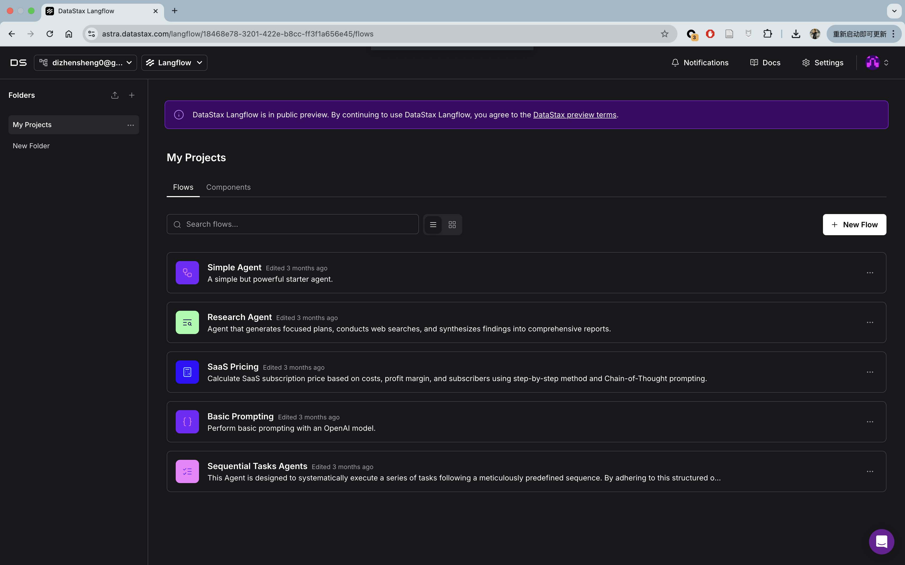

## 常用智能体构建

在开始构建具体的智能体之前，让我们先了解一下几种常见的智能体类型：

1. **简单对话型智能体（ChatBot）**
   - 最基础的智能体类型
   - 主要功能是与用户进行基础的问答交互
   - 适用于客服、信息咨询等简单场景
   - 通常基于大语言模型，如GPT系列

2. **知识增强型智能体（RAG）**
   - 结合检索增强生成（Retrieval-Augmented Generation）技术
   - 能够基于特定知识库进行回答
   - 适用于专业领域咨询、文档问答等场景
   - 可以保证回答的准确性和知识相关性

3. **任务型智能体（Agent）**
   - 具备规划和执行能力的高级智能体
   - 可以调用外部工具和API完成复杂任务
   - 适用于自动化流程、数据分析等场景
   - 通常采用ReAct等推理框架

4. **多智能体系统**
   - 多个智能体协同工作的复杂系统
   - 每个智能体负责特定的任务或角色
   - 适用于需要多方协作的复杂场景
   - 可以模拟真实的团队协作过程

接下来，我们将逐一介绍如何使用Langflow构建这些不同类型的智能体。点击langflow主页上的`New Flow` 即可看到三种类型的应用
- **Basic Prompting**: 简单对话型智能体（ChatBot）
- **Vector Store RAG**: 知识增强型智能体（RAG）
- **Simple Agent**: 任务型智能体（Agent）

### 简易ChatBot
1. 选择`Basic Prompting` 开启智能体构建页面
2. 点击 `OpenAI` 组件的 `Controls` 设置模型参数
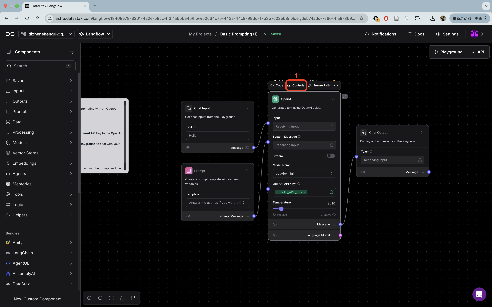
3. 修改`OpenAI API Base`为自己访问的模型的地址，`OpenAI API Key`设置自己的API，`Model Name`选择使用的模型。
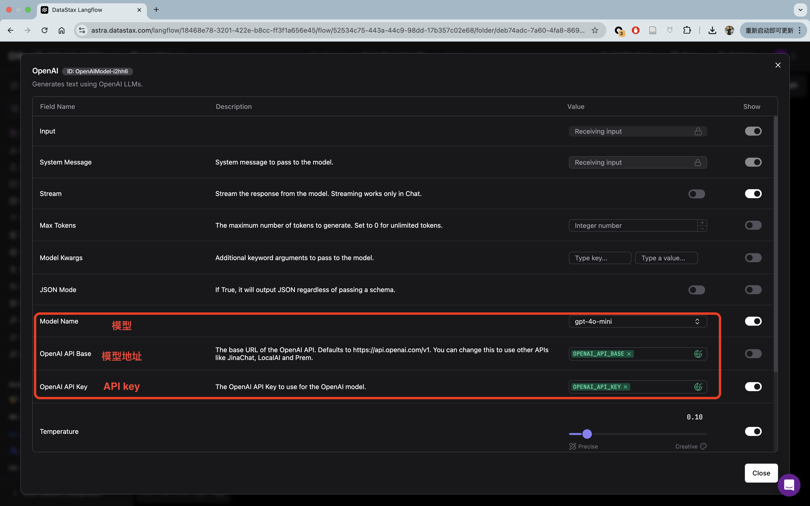
4. 如果使用的是非OpenAI的模型，也可以在左边的`Components`中的`Models`下选择其他模型，然后重复2，3步骤
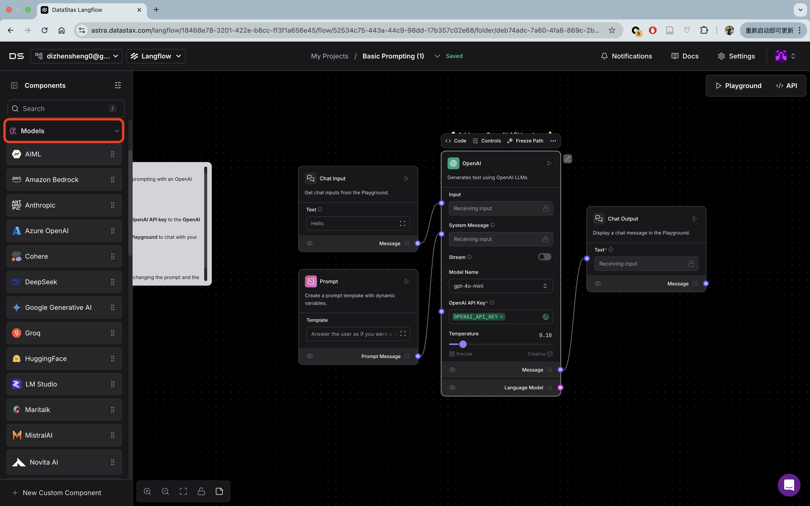
5. 点击右上角的`Playground`即可开启对话
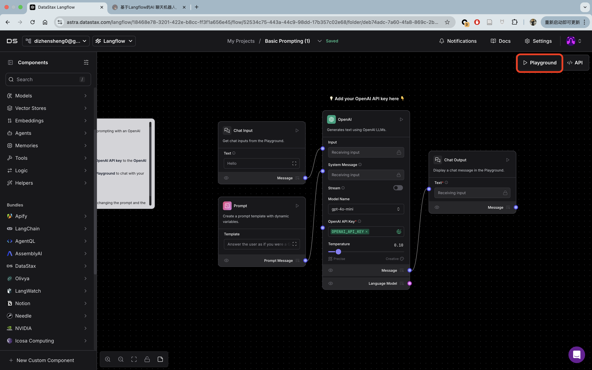


### RAG应用
1. 选择`Vector Store RAG` 开启智能体构建页面,主要分为两部分
- 下半部分为知识库构建
- 上半部分为知识库对话
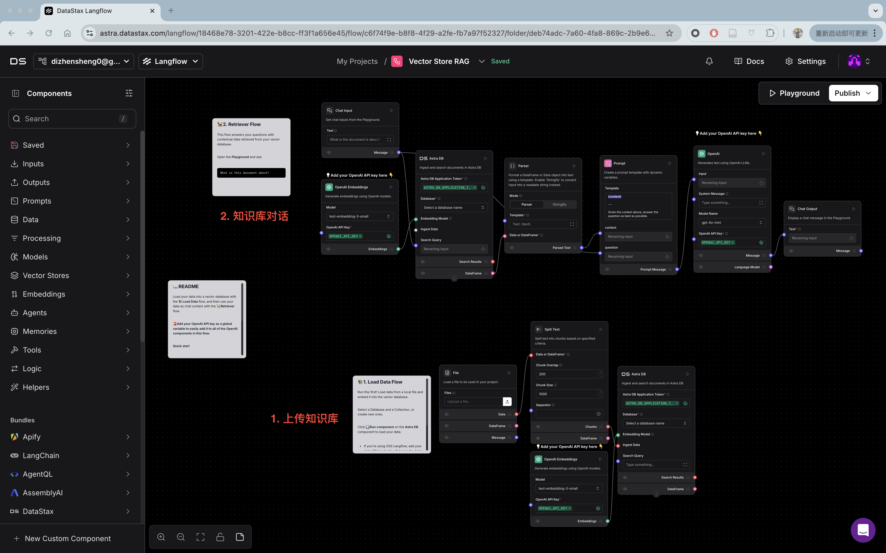
2. 为了方便起见，可以把向量数据库更改为`Chroma DB`, 不需要依赖外部平台
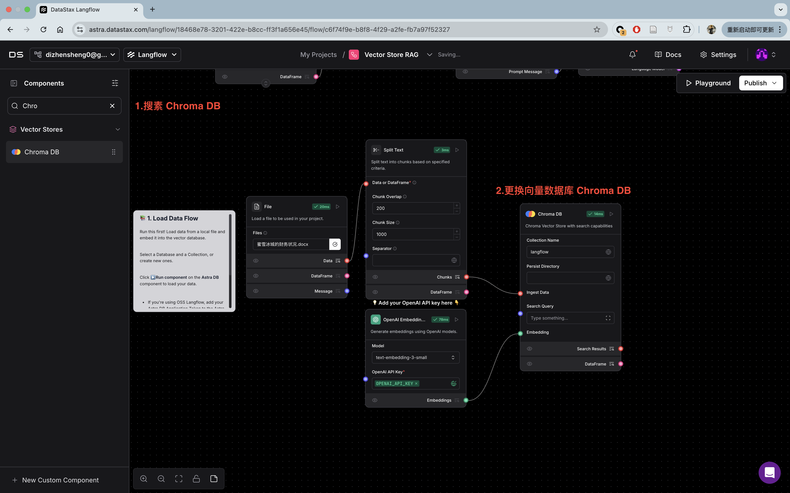
3. 点击`File`中的文件上传，配置好`Embedding`模型，点击`Chroma DB`右上角的执行即可完成知识库上传
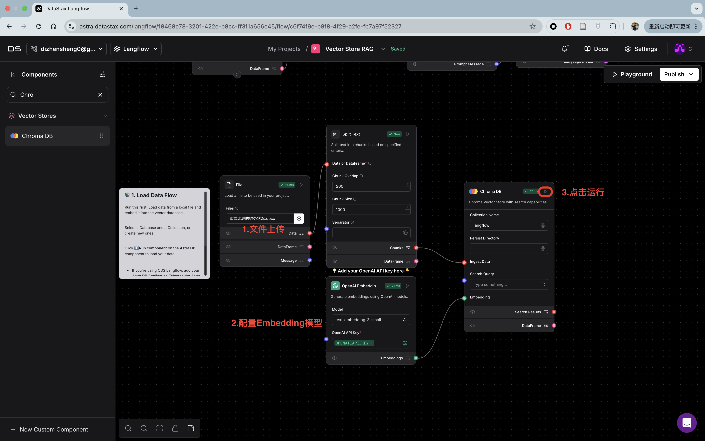
4. 点击组件之间的连接点还可以看到输入输出
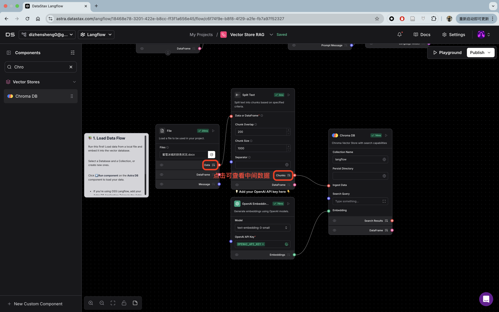
5. 配置好`OpenAI Embedding` 和 `OpenAI` 对应的模型，更换向量数据库为在第2步构建的向量数据库
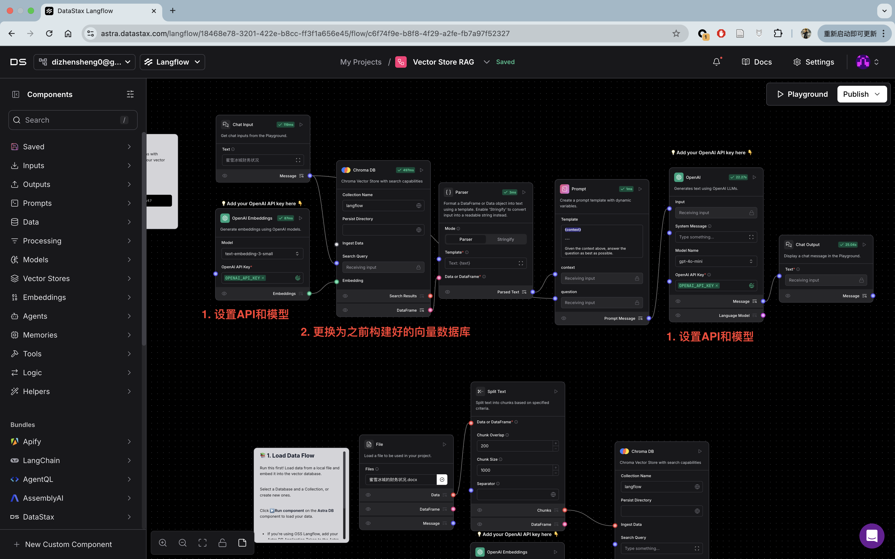
6. 点击右上角的Playground就可以与知识库对话了

### Agent
1. 选择`Simple Agent` 开启智能体构建页面
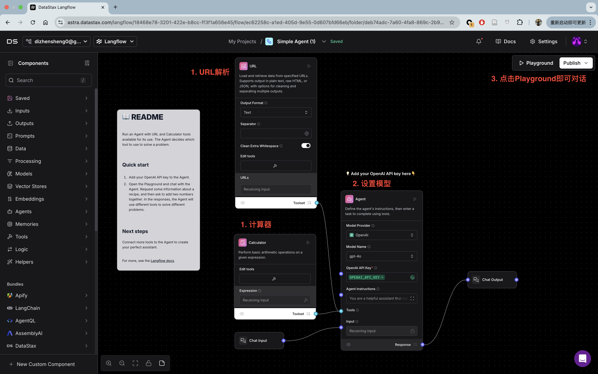
2. 这个示例Agent提供了两个工具`URL`解析和`计算器`，这两个工具无需配置即可使用，模型需要根据自己情况进行配置
3. 点击右上角的`Playground`即可开启对话
- 可以看到Agent在面对计算题时会选择调用`CalculatorComponent`获取结果
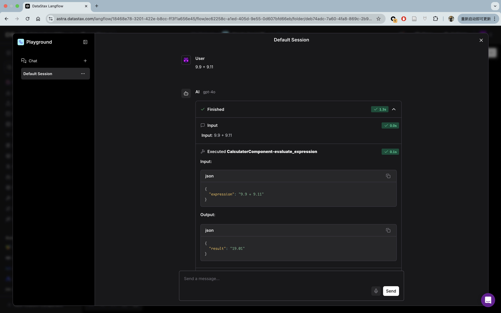
- 可以看到在提供给Agent链接时它会选择调用`URL-fetch`获取链接内容
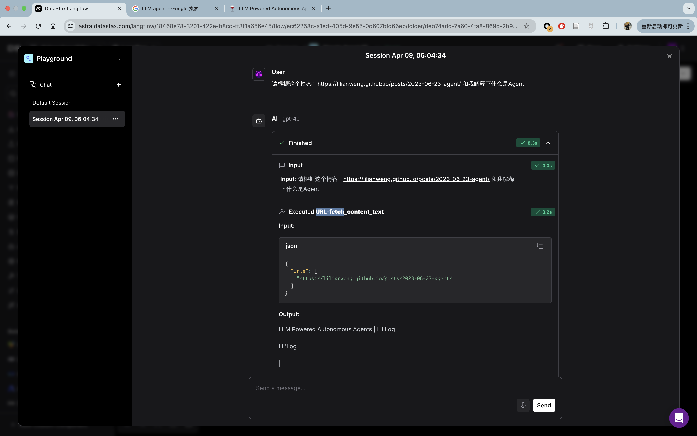