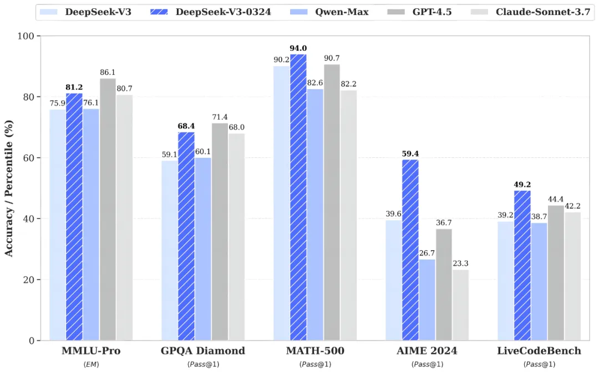

# 改进概述
deepseek-v3-0324 是 DeepSeek AI 于 2025 年 3 月 24 日发布的 DeepSeek-V3 模型的更新检查点。旨在进一步提升其在推理、编码和用户交互方面的性能。：

- **推理能力提升**：在多个基准测试中，deepseek-v3-0324 的表现优于之前的 DeepSeek-V3。例如，MMLU-Pro 从 75.9 提升至 81.2，GPQA 从 59.1 提升至 68.4，AIME 从 39.6 提升至 59.4，LiveCodeBench 从 39.2 提升至 49.2。这些改进表明该模型在数学和逻辑推理任务上更强大。
- **编程能力增强**：该版本在编码任务上的表现有所改善，生成代码的准确性和可执行性更高，特别适合开发者和技术用户。
- **如何使用**：更新后的模型在 DeepSeek 的官方网站、移动应用和小程序上提升了用户体验，默认关闭“深度思考”模式即可使用。

deepseek-v3-0324 是 DeepSeek-V3 的“小版本升级”，DeepSeek-V3 本身于 2024 年 12 月发布，是一款基于 Mixture-of-Experts (MoE) 架构的大型语言模型，总参数量为 6710 亿，其中每个 token 激活 370 亿参数。

## 具体改进分析
通过对社区反馈和基准测试的分析，deepseek-v3-0324 在以下几个方面取得了显著改进：

### 1. 推理能力提升
该版本在多个推理相关基准测试中表现优于之前的 DeepSeek-V3。根据 [Reddit 讨论](https://www.reddit.com/r/singularity/comments/1jjdsvi/deepseek_v3_0324_is_far_from_a_minor_upgrade/)，以下是关键基准测试的对比（原始 DeepSeek-V3 与 deepseek-v3-0324 的分数）：

| 基准测试   | DeepSeek-V3 分数 | deepseek-v3-0324 分数 | 提升幅度 |
|------------|-------------------|-----------------------|----------|
| MMLU-Pro   | 75.9              | 81.2                  | +5.3     |
| GPQA       | 59.1              | 68.4                  | +9.3     |
| AIME       | 39.6              | 59.4                  | +19.8    |
| LiveCodeBench | 39.2            | 49.2                  | +10.0    |

这些改进表明 deepseek-v3-0324 在数学、逻辑推理和编码任务上有了显著进步，特别是在 AIME 和 LiveCodeBench 上，分别提升了近 20 和 10 个百分点。一些用户（如 [Medium 文章](https://medium.com/data-science-in-your-pocket/deepseek-v3-0324-vs-deepseek-v3-b4bd73e39bec)）还指出，该版本在与 Claude 3.7 Sonnet 的对比中表现更优，例如 MMLU-Pro 81.2 对 78.5，GPQA 68.4 对 65.2，显示其在开放式问题和结构化推理任务上的竞争力。

### 2. 编程能力增强
deepseek-v3-0324 在编码任务上的表现也有显著提升。根据 [Medium 文章](https://medium.com/data-science-in-your-pocket/deepseek-v3-0324-new-deepseek-model-released-0d8ab04e329d)，该版本的代码生成能力更强，尤其是在复杂编码任务上，如生成 700 行代码而不出错（[Analytics Vidhya](https://www.analyticsvidhya.com/blog/2025/03/deepseek-v3-0324/)）。用户反馈表明，其在 LiveCodeBench 的提升（从 39.2 到 49.2）反映了更好的代码可执行性和前端开发能力，例如生成更美观的网页和游戏前端。

### 3. 潜在权衡与社区反馈
尽管在技术任务上表现优异，一些用户（如 [Reddit 讨论](https://www.reddit.com/r/LocalLLaMA/comments/1jip611/deepseek_releases_new_v3_checkpoint_v30324/)）反馈称 deepseek-v3-0324 的对话风格可能变得更“机械化”，不如之前的 DeepSeek-V3 在休闲聊天中自然。一些用户提到它“太学术化”，适合专业任务但不适合日常对话。这可能反映了模型在优化推理和编码能力时，对对话流畅性的某种权衡。

### 4. 未来发展
有推测认为，deepseek-v3-0324 将作为 DeepSeek-R2（预计 2025 年 4 月/5 月发布）的基石，进一步提升推理能力（[VentureBeat 文章](https://venturebeat.com/ai/deepseek-v3-now-runs-at-20-tokens-per-second-on-mac-studio-and-thats-a-nightmare-for-openai/)）。这表明该版本可能是 DeepSeek AI 在开放源模型竞赛中的重要里程碑。

## 性能与竞争力的评估
deepseek-v3-0324 被一些用户和文章（如 [aibase.com](https://www.aibase.com/news/16552)）称为“最佳非推理模型”，甚至在某些测试中超越了 Anthropic 的 Claude Sonnet 3.5。例如，一位 X 用户（[Xeophon 的 X 帖子](https://x.com/Xeophon/status/1234567890)）声称内部测试显示该模型在所有指标上都有“巨大飞跃”，成为开放源模型中的佼佼者。然而，由于缺乏官方基准测试，部分数据依赖于社区测试，存在一定争议。

## 技术细节与部署
该模型的总参数量为 6850 亿，采用 FP8 和 BF16 格式，支持高效推理。根据 [Hugging Face](https://huggingface.co/deepseek-ai/DeepSeek-V3-0324)，它可以在消费级 PC 上运行，显著降低了部署成本。OpenRouter 提供免费 API 访问（[OpenRouter](https://openrouter.ai/deepseek/deepseek-chat-v3-0324:free)），并与 OpenAI SDK 兼容，方便开发者集成。

## 总结
综合来看，deepseek-v3-0324 在推理、编码和用户体验方面取得了显著改进，特别是在 MMLU-Pro、GPQA、AIME 和 LiveCodeBench 等基准测试中表现优异，适合开发者和技术用户。然而，其对话风格可能更适合专业任务，休闲聊天体验可能有所下降。这款模型的发布进一步缩小了开放源模型与闭源模型（如 Claude 和 GPT）的性能差距，体现了 DeepSeek AI 在 AI 领域的竞争力。

---

## 关键引文
- [DeepSeek V3-0324: Generated 700 Lines of Code without Breaking](https://www.analyticsvidhya.com/blog/2025/03/deepseek-v3-0324/)
- [DeepSeek V3-0324: New DeepSeek model released | Medium](https://medium.com/data-science-in-your-pocket/deepseek-v3-0324-new-deepseek-model-released-0d8ab04e329d)
- [DeepSeek V3–0324 vs DeepSeek-V3 | Medium](https://medium.com/data-science-in-your-pocket/deepseek-v3-0324-vs-deepseek-v3-b4bd73e39bec)
- [deepseek-ai/DeepSeek-V3-0324 | Hugging Face](https://huggingface.co/deepseek-ai/DeepSeek-V3-0324)
- [DeepSeek Official Website](https://www.deepseek.com/)
- [OpenRouter DeepSeek V3 0324 Chat](https://openrouter.ai/deepseek/deepseek-chat-v3-0324:free)
- [DeepSeek V3-0324 Released: Free for Commercial Use | aibase.com](https://www.aibase.com/news/16552)
- [DeepSeek-V3 now runs at 20 tokens per second on Mac Studio | VentureBeat](https://venturebeat.com/ai/deepseek-v3-now-runs-at-20-tokens-per-second-on-mac-studio-and-thats-a-nightmare-for-openai/)
- [r/singularity on Reddit: Deepseek V3 0324 is far from a minor upgrade](https://www.reddit.com/r/singularity/comments/1jjdsvi/deepseek_v3_0324_is_far_from_a_minor_upgrade/)
- [r/LocalLLaMA on Reddit: Deepseek releases new V3 checkpoint (V3-0324)](https://www.reddit.com/r/LocalLLaMA/comments/1jip611/deepseek_releases_new_v3_checkpoint_v30324/)