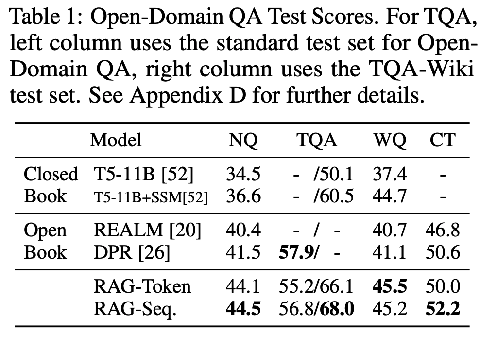
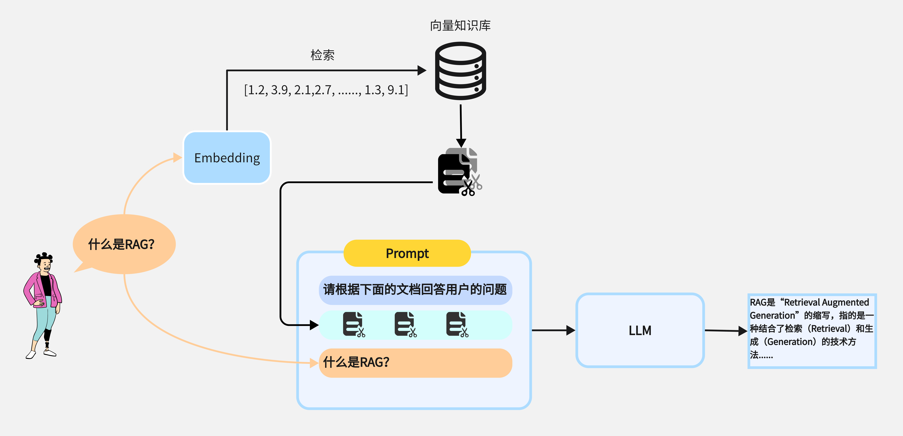

## 1、介绍
在大模型的使用过程中，我们会发现大模型在面对一些无法回答的问题时会自信的给出错误的答案，即模型的“幻觉”(Hallucinations)现象。这种现象主要源于大模型的训练方式和其内在的工作机制。大模型尤其是基于Transformer架构的预训练模型，是通过在大规模数据集上进行无监督学习，学习到语言的统计规律和模式。然而，这种学习方式并不能确保模型完全理解其生成内容的逻辑和真实性。因此大模型在面对实时，专有的以及特定领域的提问时的回答会经常出现事实性错误。

在实际应用中，特别是在医疗、金融、工业等对准确性要求极高的领域，幻觉现象可能会产生严重后果。比如：
1. 医疗模型给出错误的诊断和用药信息：这种错误可能会对患者的生命安全造成威胁，错误的诊断可能导致错过最佳治疗时机，错误的用药信息可能导致药物不良反应甚至死亡。

2. 工业模型给出错误的分析和建议：在工业生产中，错误的分析和建议可能导致生产效率下降、产品质量问题、设备损坏或安全事故发生，造成巨大的经济损失和安全隐患。

在2020年，Meta AI [Lewis, Patrick, et al.2020](https://arxiv.org/pdf/2005.11401) 提出来使用信息检索的方式来辅助大模型进行内容生成，显著提高了在大模型在知识密集的任务中的生成效果。这篇论文提出了一个完整的RAG框架，展示了如何在多个知识密集型NLP任务中有效地利用RAG，如问答、对话生成和文档摘要。

从Table1可以看到在四个测试数据集上，使用RAG相比只靠模型能力(Closed Book)带来了显著的性能提升。

## 2、RAG工作原理
RAG（Retrieval-Augmented Generation）的核心思想是在生成答案之前，先从一个大型知识库或文档集合中检索相关信息，并将这些信息作为额外输入提供给大模型，从而提高生成内容的质量。这种方法将大模型的知识和推理能力进行分离，因此在处理实时的、专有的以及特定领域的问题时，大模型可以借助外部知识来填补自身知识的不足，同时利用其推理能力生成正确的答案。

在实际应用中，RAG主要分为两个阶段：向量数据库构建（离线）阶段和检索增强生成（在线）阶段。

### 2.1 向量数据库
向量数据库是RAG应用的基础，这个数据库作为外部知识库，包含了RAG应用所需的所有的额外信息。向量数据库的质量直接决定了RAG应用的性能下限，一个高质量的向量数据库能够在使用更少的token的情况下，提供回答用户问题所需的更多背景信息。因此，在实际业务场景中，高质量的向量数据库不仅能够显著提升应用的准确性，还能有效降低推理成本。

#### 2.1.1 使用LangChain构建向量数据库的流程

1. 准备

首先，需要安装 `LangChain` 以及其他相关库，如向量数据库 `langchain-chroma`, OpenAI模型 `langchain-openai`
```shell
pip install -qU "langchain-chroma" "langchain-openai"
```
设置OpenAI API key
```python
import os

# os.environ['OPENAI_API_BASE'] = '<OPENAI API BASE>'
os.environ['OPENAI_API_KEY'] = '<YOUR OPENAI API KEY>'
```

2. 文本解析

在这个示例中，我们使用`WebBaseLoader`加载本篇博客，然后使用`BeautifulSoup`提取`HTML`中内容转化为文本
```python
import bs4
from langchain_community.document_loaders import WebBaseLoader

loader = WebBaseLoader(
    web_paths=(
    "https://blackdzs.github.io/posts/%E4%BB%8E%E9%9B%B6%E6%9E%84%E5%BB%BArag%E5%BA%94%E7%94%A8/",
    ),
    bs_kwargs=dict(
        parse_only=bs4.SoupStrainer(
            class_=("post-content", "post-title", "post-header")
        )
    ),
)
documents = loader.load()
print(documents[0].page_content[:21])
```

```shell
Home » Posts【RAG应用开发】
```
这段代码提取了原始`HTML`中的`post-content`,`post-title`和`post-header`三部分的内容并保存为`Langchain Document`格式，我们可以使用`page_content`属性访问到解析后的文本。

3. 文档分块

我们提到，高质量的向量数据库应在使用少量`token`的情况下包含更多信息，而文档分块（chunking）的主要目的是将文档内容进行合理分割，将同一概念下的相关内容集中在同一个`chunk`中。这样，在进行检索时，只需选择最相关的`chunk`即可，从而在获取相关信息的同时有效减少了`token`的数量。

```python
# 导入必要的库
from langchain.text_splitter import RecursiveCharacterTextSplitter

# 使用RecursiveCharacterTextSplitter将较长的文本拆分成更小的块
text_splitter = RecursiveCharacterTextSplitter(chunk_size=300, chunk_overlap=100)
split_documents = text_splitter.split_documents(documents)
```
在上面的示例中我们使用`RecursiveCharacterTextSplitter`文档分割方法

4. 构建向量数据库

在这个示例中我们使用`Chroma`作为向量数据库
```python
from langchain_openai import OpenAIEmbeddings
from langchain_chroma import Chroma

embeddings = OpenAIEmbeddings()
vectorstore = Chroma.from_documents(documents=split_documents, embedding=embeddings)
```



向量数据库构建阶段的核心任务是将多种来源的非结构化数据经过处理和编码，转化为一个结构化且易于检索的知识库。这个知识库将在 RAG 系统中作为后续检索和生成答案的重要基础。

### 2.2 检索增强生成(RAG)

1. 构建检索器
在向量数据库构建完成后我们就可以在询问大模型问题时进行使用了，在`Langchain`中构建的任何`vectorstore`都可以使用`as_retriever`转化为检索器，同时可以设置检索器的参数，如检索文档时向量计算方法`search_type`, 返回文档数量`k`。

```python
retriever = vectorstore.as_retriever(search_type="similarity", search_kwargs={"k": 3})
retrieved_docs = retriever.invoke("什么是RAG")
print(len(retrieved_docs))
```

```shell
3
```

2. 生成答案
接下来是根据检索器检索到的内容生成回答，我们需要将`retrieved_docs` 和 `question`构造成模型输入的`Prompt`, 然后输入到模型中生成回答。
```python
from langchain_openai import ChatOpenAI
from langchain import hub

prompt = hub.pull("rlm/rag-prompt")
llm = ChatOpenAI(model="gpt-4o-mini")
print(prompt)
```

```shell
input_variables=['context', 'question'] input_types={} partial_variables={} metadata={'lc_hub_owner': 'rlm', 'lc_hub_repo': 'rag-prompt', 'lc_hub_commit_hash': '50442af133e61576e74536c6556cefe1fac147cad032f4377b60c436e6cdcb6e'} messages=[HumanMessagePromptTemplate(prompt=PromptTemplate(input_variables=['context', 'question'], input_types={}, partial_variables={}, template="You are an assistant for question-answering tasks. Use the following pieces of retrieved context to answer the question. If you don't know the answer, just say that you don't know. Use three sentences maximum and keep the answer concise.\nQuestion: {question} \nContext: {context} \nAnswer:"), additional_kwargs={})]
```
其中template内容为：
```markdown
You are an assistant for question-answering tasks. Use the following pieces of retrieved context to answer the question. 
If you don't know the answer, just say that you don't know. Use three sentences maximum and keep the answer concise.
Question: {question} 
Context: {context} 
Answer:
```

```python
from langchain_core.output_parsers import StrOutputParser
from langchain_core.runnables import RunnablePassthrough


def format_docs(docs):
    res = "\n\n".join(doc.page_content for doc in docs)
    print(res)
    return res


rag_chain = (
    {"context": retriever | format_docs, "question": RunnablePassthrough()}
    | prompt
    | llm
    | StrOutputParser()
)

for chunk in rag_chain.stream("什么是RAG"):
    print(chunk, end="", flush=True)
```

下图为检索增强生成阶段的主要流程：



在本篇文章中我们介绍了RAG的工作原理与基于`Langchain`实现简单的RAG应用，在下一篇文章中我们讨论[如何评估RAG应用](/posts/rag应用开发指南二如何评估与优化rag应用性能/ "如何评估与优化RAG应用性能")


## 参考
1. Lewis, Patrick, et al. ["Retrieval-augmented generation for knowledge-intensive nlp tasks."](https://arxiv.org/pdf/2005.11401) Advances in Neural Information Processing Systems 33 (2020): 9459-9474.
2. https://python.langchain.com/docs/tutorials/rag/#indexing-store
