## 介绍
在[深入解析RAG原理与实现](/p/rag_how_to_build_rag_by_langchain/ "深入解析RAG原理与实现")一文中，我们探讨了如何构建RAG应用。然而，在成功构建RAG应用后，新的挑战随之而来：如何评估其性能？我们需要什么样的量化指标来进行有效的评估？

## RAG评估

### 评估指标
在RAG流程中，主要包括三个核心部分：问题（Query）、检索到的文档（Context）以及模型生成的答案（Answer）。在评估过程中，我们还需要真实答案（Ground Truth）作为基准。在RAG应用中，我们关注两个关键点：其一是检索到的文档（Context），其二是基于检索到的文档所生成的答案（Answer）。下图1展示了这两个部分设置的评估指标，其中左侧列出了与`Answer`相关的指标，右侧则呈现了与`Context`相关的指标。指标计算方法可以参考[RAGAS Metrics](https://docs.ragas.io/en/stable/concepts/metrics/index.html)

- **Context**
    - Context Precision: 根据Context和Ground Truth计算检索到的Context准确率
    - Context Recall: 根据Context和Ground Truth计算检索到的Context召回率
    - Context Entities Recall: 根据Context和Ground Truth计算检索到的Context 中Entities的召回率

- **Answer**
    - Answer Faithfulness: 根据Context和Answer计算Answer是否来源于Context
    - Answer Semantic Similarity: 根据Ground Truth和Answer计算Answer与Ground Truth的语义相似性(使用Embedding向量计算)
    - Answer Correctness: 根据Ground Truth和Answer计算Answer准确率(使用LLM判断)

通过以上评估指标，我们能够更全面地评价RAG系统的性能。

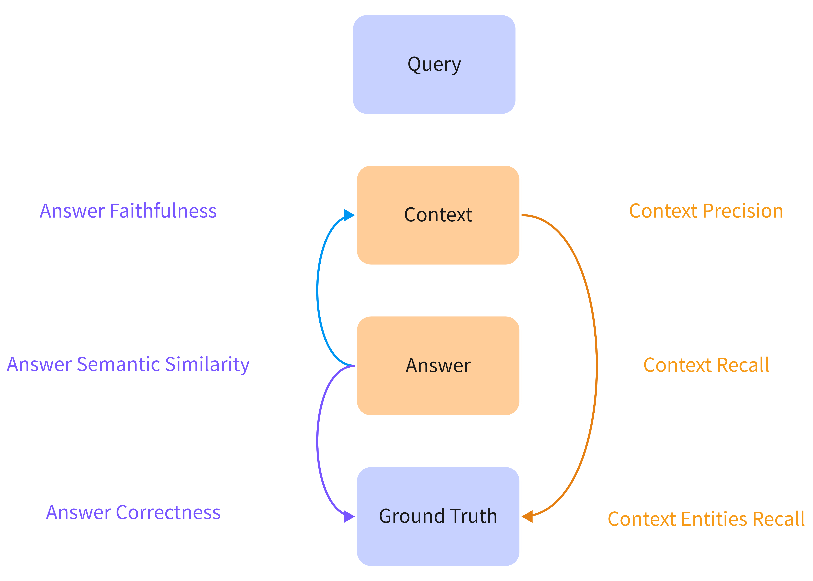

### 计算方法
尽管大型语言模型（LLM）的上下文长度已显著增加，能够将整个文档甚至文本语料库纳入上下文窗口，但在实际应用中，这种做法往往效率低下，容易分散模型的注意力，同时也会增加推理延迟和成本。对于任何特定查询，仅有少量的文本可能具有相关性，但在每次推理时，上下文窗口中的所有token都需被处理。理想情况下，LLM 应该只处理与查询相关的token。因此，在检索增强生成（RAG）应用中，检索过程的主要目标便是精准识别并提取与给定查询相关的token。

#### Context Precison

Context Precision（上下文精度）是信息检索和问答系统中用来评估检索结果质量的重要指标之一。在检索过程中，系统可能会返回多个与用户查询相关的文档，这些文档的内容可能会对生成答案产生不同程度的影响。Context Precision的核心在于衡量在检索到的所有相关文档中，有多少文档实际上对生成用户需要的答案是有帮助的。

\[
   Context\:Precision = \frac{有用的文档数量}{相关文档数量}
\]


- 相关文档数量 ：指检索系统返回的所有相关文档的总数。
- 有用文档数量 ：指在这些相关文档中，能够为生成正确答案提供有效信息的文档数量。

那么如何衡量文档对于答案生成是否有用呢？传统的NLP方法中可以使用EM算法，或者计算文档和答案之间词级匹配，这些方法仅计算词级别的重叠，忽略了语义上的近似表达。例如，“机器学习用于预测”与“模型被训练来预测”语义相近，但词汇不完全匹配，导致得分偏低。对于开放性问答任务，上下文和答案可能有多种合理表述，传统的机器学习方法无法处理这种问题。同时如果文档包含大量与问题无关的内容，只是偶尔提到了一些相关词汇，会导致误判。为了解决这些问题，可以使用基于大模型的计算方法，依赖于大模型的上下文学习以及推理能力进行判断文档对于答案生成是否有用，如：

```
问题：什么是机器学习？ 
文档：机器学习是一种通过数据训练模型的技术，用于模式识别和预测。
提示：这个文档是否足以回答问题？请在1-5之间打分，并解释原因。
```

下面是对于衡量文档对于答案生成是否有用的Prompt示例，其中包含指令，格式化输出，示例和输入，通过这种设计方式可以让大模型生成格式化的评估结果。

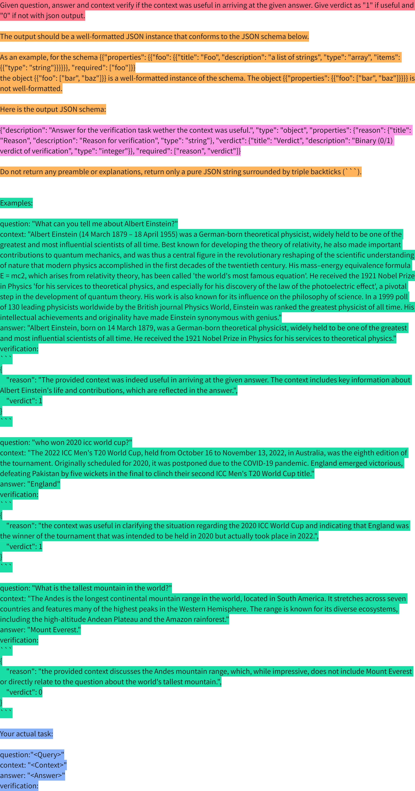

因此Context Precision的计算过程如图3所示，首先是根据用户问题检索相关文档，对于每个文档使用图2中的Prompt输入到大模型中，获取大模型对于文档是否有用的判断，最终根据有用的文档数量计算`Context Precision`

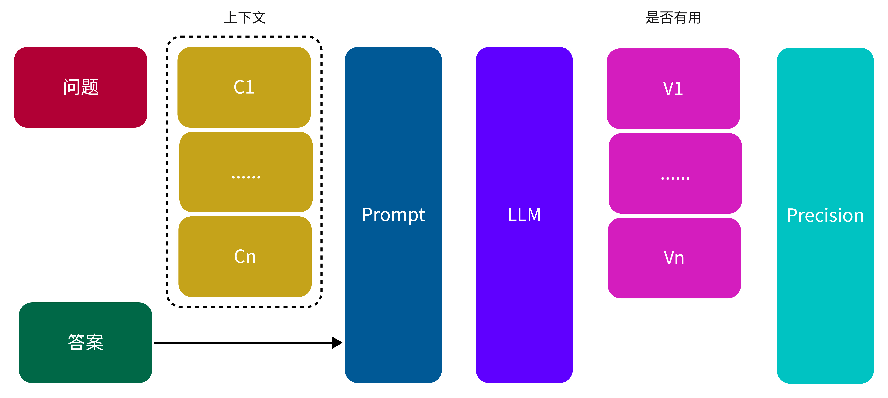

```python
import json
from langchain_openai import ChatOpenAI

from langchain_core.prompts import ChatPromptTemplate


llm = ChatOpenAI(
    api_key="your_api_key",
    model="gpt-4o-mini"
)

PROMPT = ChatPromptTemplate.from_messages(
    [
        (
            "system", 
            """
            Given question, answer and context verify if the context was useful in arriving at the given answer. Give verdict as "1" if useful and "0" if not with json output.

            The output should be a well-formatted JSON instance that conforms to the JSON schema below.

            As an example, for the schema {{"properties": {{"foo": {{"title": "Foo", "description": "a list of strings", "type": "array", "items": {{"type": "string"}}}}}}, "required": ["foo"]}}
            the object {{"foo": ["bar", "baz"]}} is a well-formatted instance of the schema. The object {{"properties": {{"foo": ["bar", "baz"]}}}} is not well-formatted.

            Here is the output JSON schema:

            {OutputSchema}
                                                
            Do not return any preamble or explanations, return only a pure JSON string surrounded by triple backticks (```).


            Examples:

            question: "What can you tell me about Albert Einstein?"
            context: "Albert Einstein (14 March 1879 – 18 April 1955) was a German-born theoretical physicist, widely held to be one of the greatest and most influential scientists of all time. Best known for developing the theory of relativity, he also made important contributions to quantum mechanics, and was thus a central figure in the revolutionary reshaping of the scientific understanding of nature that modern physics accomplished in the first decades of the twentieth century. His mass–energy equivalence formula E = mc2, which arises from relativity theory, has been called 'the world's most famous equation'. He received the 1921 Nobel Prize in Physics 'for his services to theoretical physics, and especially for his discovery of the law of the photoelectric effect', a pivotal step in the development of quantum theory. His work is also known for its influence on the philosophy of science. In a 1999 poll of 130 leading physicists worldwide by the British journal Physics World, Einstein was ranked the greatest physicist of all time. His intellectual achievements and originality have made Einstein synonymous with genius."
            answer: "Albert Einstein, born on 14 March 1879, was a German-born theoretical physicist, widely held to be one of the greatest and most influential scientists of all time. He received the 1921 Nobel Prize in Physics for his services to theoretical physics."
            verification:
            {{
                "reason": "The provided context was indeed useful in arriving at the given answer. The context includes key information about Albert Einstein's life and contributions, which are reflected in the answer.",
                "verdict": 1
            }}

            question: "who won 2020 icc world cup?"
            context: "The 2022 ICC Men's T20 World Cup, held from October 16 to November 13, 2022, in Australia, was the eighth edition of the tournament. Originally scheduled for 2020, it was postponed due to the COVID-19 pandemic. England emerged victorious, defeating Pakistan by five wickets in the final to clinch their second ICC Men's T20 World Cup title."
            answer: "England"
            verification:
            {{
                "reason": "the context was useful in clarifying the situation regarding the 2020 ICC World Cup and indicating that England was the winner of the tournament that was intended to be held in 2020 but actually took place in 2022.",
                "verdict": 1
            }}

            question: "What is the tallest mountain in the world?"
            context: "The Andes is the longest continental mountain range in the world, located in South America. It stretches across seven countries and features many of the highest peaks in the Western Hemisphere. The range is known for its diverse ecosystems, including the high-altitude Andean Plateau and the Amazon rainforest."
            answer: "Mount Everest."
            verification:
            {{
                "reason": "the provided context discusses the Andes mountain range, which, while impressive, does not include Mount Everest or directly relate to the question about the world's tallest mountain.",
                "verdict": 0
            }}


            Your actual task:
            """
        ),
        (
            "human",
            """
            Your actual task:
            question: "{Query}"
            context: "{Context}"
            answer: "{Answer}"
            verification:
            """
        )
    ]
)    

def get_v(query, context, answer):
    output_schema = """{"description": "Answer for the verification task wether the context was useful.", "type": "object", "properties": {"reason": {"title": "Reason", "description": "Reason for verification", "type": "string"}, "verdict": {"title": "Verdict", "description": "Binary (0/1) verdict of verification", "type": "integer"}}, "required": ["reason", "verdict"]}"""
    chain = PROMPT | llm
    result = chain.invoke(
        {
            "OutputSchema": output_schema, "Query": query, "Context": context, "Answer": answer
        }
    )
    content = result.content
    if content.startswith("```json"):
        content = content.replace("```json", "")
    if content.endswith("```"):
        content = content.replace("```", "")
    try:
        content = json.loads(content)
        verdict = content["verdict"]
    except:
        verdict = None
    print(content)
    return verdict

verdicts = []
query = "艾菲尔铁塔在哪里"
contexts = [
    "埃菲尔铁塔（也常称为巴黎铁塔）是位于法国巴黎第七区、塞纳河畔战神广场的铁制镂空塔，世界著名建筑，也是法国文化象征之一[3]，巴黎城市地标之一，巴黎最高建筑物",
    "埃菲尔铁塔建成于1889年，初名为“三百米塔”，后得名自其设计师居斯塔夫·埃菲尔。"
]
answer = "艾菲尔铁塔位于巴黎"
for context in contexts:
    verdicts.append(get_v(query=query, context=context, answer=answer))
print("Context Precision: ", sum(verdicts) / len(verdicts))
```

```text
{'reason': '提供的上下文直接描述了艾菲尔铁塔的位置，明确说明它位于法国巴黎，因此上下文对于得出答案是非常有用的。', 'verdict': 1}
{'reason': '上下文提到艾菲尔铁塔的建设和设计师，但没有直接说明它的位置，因此在回答中提到艾菲尔铁塔位于巴黎的内容未得到上下文的支持。', 'verdict': 0}
Context Precision:  0.5
```

#### Context Recall

Context Recall（上下文召回率） 是一种用于评估信息检索系统中检索结果覆盖程度的重要指标。它反映了系统在上下文中检索到的内容与预期信息（即 Ground Truth）之间的匹配程度。在开放问答系统中，Ground Truth 表示预期答案的完整内容或参考答案。Context Recall 的计算流程是通过将 Ground Truth 分解为多个独立的观点（statement），并判断这些句子是否能在检索到的上下文中找到对应内容。

Context Recall 的计算公式如下：

\[
    Context\:Recall = \frac{上下文中存在的正确观点数量}{Ground Truth 的所有观点数量}
\]

- 上下文中存在的正确观点数量：在给定上下文中能够找到支持的观点的数量。
- Ground Truth 的所有观点数量：答案中涉及的所有观点的数量。

**Prompt 示例**

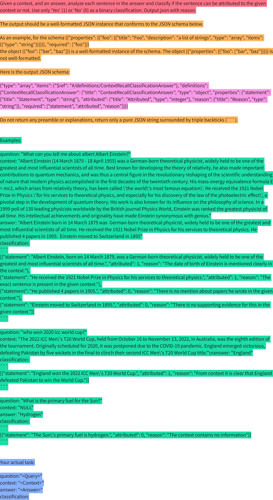


**Context Recall 计算流程**
```
1. 检索上下文：从信息源中获取相关上下文。
2. 大模型判断：将Query, Context, Ground Truth 填入 Prompt 交给大模型，判断是否在上下文中找到匹配的观点(statement)。
3. 计算 Context Recall：根据分类为1的statement和总statement计算召回率。
```

下图展示了 Context Recall 的计算过程：

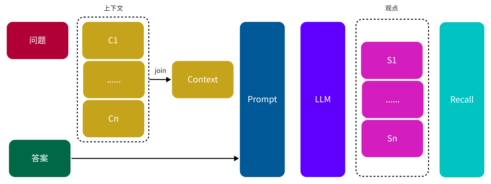

```python
import json
from pprint import pprint
from langchain_openai import ChatOpenAI

from langchain_core.prompts import ChatPromptTemplate


llm = ChatOpenAI(
    api_key="your_api_key",
    model="gpt-4o-mini"
)

PROMPT = ChatPromptTemplate.from_messages(
    [
        (
            "system", 
            """
            Given a context, and an answer, analyze each sentence in the answer and classify if the sentence can be attributed to the given context or not. Use only 'Yes' (1) or 'No' (0) as a binary classification. Output json with reason.

            The output should be a well-formatted JSON instance that conforms to the JSON schema below.

            As an example, for the schema {{"properties": {{"foo": {{"title": "Foo", "description": "a list of strings", "type": "array", "items": {{"type": "string"}}}}}}, "required": ["foo"]}}
            the object {{"foo": ["bar", "baz"]}} is a well-formatted instance of the schema. The object {{"properties": {{"foo": ["bar", "baz"]}}}} is not well-formatted.

            Here is the output JSON schema:

            {OutputSchema}
                                                
            Do not return any preamble or explanations, return only a pure JSON string surrounded by triple backticks (```).


            Examples:

            question: "What can you tell me about albert Albert Einstein?"
            context: "Albert Einstein (14 March 1879 - 18 April 1955) was a German-born theoretical physicist, widely held to be one of the greatest and most influential scientists of all time. Best known for developing the theory of relativity, he also made important contributions to quantum mechanics, and was thus a central figure in the revolutionary reshaping of the scientific understanding of nature that modern physics accomplished in the first decades of the twentieth century. His mass-energy equivalence formula E = mc2, which arises from relativity theory, has been called \'the world\'s most famous equation\'. He received the 1921 Nobel Prize in Physics \'for his services to theoretical physics, and especially for his discovery of the law of the photoelectric effect\', a pivotal step in the development of quantum theory. His work is also known for its influence on the philosophy of science. In a 1999 poll of 130 leading physicists worldwide by the British journal Physics World, Einstein was ranked the greatest physicist of all time. His intellectual achievements and originality have made Einstein synonymous with genius."
            answer: "Albert Einstein born in 14 March 1879 was  German-born theoretical physicist, widely held to be one of the greatest and most influential scientists of all time. He received the 1921 Nobel Prize in Physics for his services to theoretical physics. He published 4 papers in 1905.  Einstein moved to Switzerland in 1895"
            classification: 
            [{{"statement": "Albert Einstein, born on 14 March 1879, was a German-born theoretical physicist, widely held to be one of the greatest and most influential scientists of all time.", "attributed": 1, "reason": "The date of birth of Einstein is mentioned clearly in the context."}}, 
            {{"statement": "He received the 1921 Nobel Prize in Physics for his services to theoretical physics.", "attributed": 1, "reason": "The exact sentence is present in the given context."}}, 
            {{"statement": "He published 4 papers in 1905.", "attributed": 0, "reason": "There is no mention about papers he wrote in the given context."}}, 
            {{"statement": "Einstein moved to Switzerland in 1895.", "attributed": 0, "reason": "There is no supporting evidence for this in the given context."}}]

            question: "who won 2020 icc world cup?"
            context: "The 2022 ICC Men\'s T20 World Cup, held from October 16 to November 13, 2022, in Australia, was the eighth edition of the tournament. Originally scheduled for 2020, it was postponed due to the COVID-19 pandemic. England emerged victorious, defeating Pakistan by five wickets in the final to clinch their second ICC Men\'s T20 World Cup title."\nanswer: "England"
            classification: 
            [{{"statement": "England won the 2022 ICC Men\'s T20 World Cup.", "attributed": 1, "reason": "From context it is clear that England defeated Pakistan to win the World Cup."}}]

            question: "What is the primary fuel for the Sun?"
            context: "NULL"
            answer: "Hydrogen"
            classification: 
            [{{"statement": "The Sun\'s primary fuel is hydrogen.", "attributed": 0, "reason": "The context contains no information"}}]

            Your actual task:
            """
        ),
        (
            "human",
            """
            Your actual task:
            question: "{Query}"
            context: "{Context}"
            answer: "{Answer}"
            classification:
            """
        )
    ]
)    

def get_v(query, context, answer):
    output_schema = """
    {"type": "array", "items": {"$ref": "#/definitions/ContextRecallClassificationAnswer"}, "definitions": {"ContextRecallClassificationAnswer": {"title": "ContextRecallClassificationAnswer", "type": "object", "properties": {"statement": {"title": "Statement", "type": "string"}, "attributed": {"title": "Attributed", "type": "integer"}, "reason": {"title": "Reason", "type": "string"}}, "required": ["statement", "attributed", "reason"]}}}
    """
    chain = PROMPT | llm
    result = chain.invoke(
        {
            "OutputSchema": output_schema, "Query": query, "Context": context, "Answer": answer
        }
    )
    content = result.content
    if content.startswith("```json"):
        content = content.replace("```json", "")
    if content.endswith("```"):
        content = content.replace("```", "")
    try:
        content = json.loads(content)
    except:
        # verdict = None
        pass
    return content

classes = []
query = "艾菲尔铁塔在哪里"
contexts = [
    "埃菲尔铁塔（也常称为巴黎铁塔）是位于法国巴黎第七区、塞纳河畔战神广场的铁制镂空塔，世界著名建筑，也是法国文化象征之一[3]，巴黎城市地标之一，巴黎最高建筑物",
    "埃菲尔铁塔建成于1889年，初名为“三百米塔”，后得名自其设计师居斯塔夫·埃菲尔。"
]
answer = """
埃菲尔铁塔（法语：Tour Eiffel，/ˈaɪfəl/ [tuʁ‿ɛfɛl] （ⓘ），也常称为巴黎铁塔）是位于法国巴黎第七区、塞纳河畔战神广场的铁制镂空塔，世界著名建筑，也是法国文化象征之一[3]，巴黎城市地标之一，巴黎最高建筑物。正式地址为Rue Anatole-France 5号。

埃菲尔铁塔建成于1889年，初名为“三百米塔”，后得名自其设计师居斯塔夫·埃菲尔。铁塔是世界建筑史上的技术杰作，也是世界上最多人付费参观的名胜古迹，这个为了世界博览会而落成的金属建筑，2011年约有698万人参观[4]，是法国参观人数第二多的文化景点。1986年美国土木工程师协会将该建筑列入国际土木工程历史古迹，1991年，埃菲尔铁塔连同巴黎塞纳河沿岸整座被列入世界遗产。[5]

埃菲尔铁塔以312米的高度，占据世界最高人造建筑的位置长达四十年，直到纽约克莱斯勒大楼的出现，其位于279.11米处的观景平台是欧盟范围内公众能够抵达的最高的观景台，在全欧洲范围内仅次于莫斯科的奥斯坦金诺电视塔。铁塔的总高度曾通过安装天线而多次提高。这些天线曾被用于许多科学实验，现在主要用于发射广播电视信号。
"""
result = get_v(query, ".".join(contexts), answer)
pprint(result[:3])
for res in result:
    classes.append(res["attributed"])
print("Context Recall: ", sum(classes) / len(classes))
```

```text
[{'attributed': 1,
  'reason': 'This statement is directly supported by the context, which '
            "describes the Eiffel Tower's location and significance.",
  'statement': '埃菲尔铁塔（法语：Tour Eiffel，/ˈaɪfəl/ [tuʁ‿ɛfɛl] '
               '（ⓘ），也常称为巴黎铁塔）是位于法国巴黎第七区、塞纳河畔战神广场的铁制镂空塔，世界著名建筑，也是法国文化象征之一，巴黎城市地标之一，巴黎最高建筑物。'},
 {'attributed': 0,
  'reason': 'The context does not mention this specific address.',
  'statement': '正式地址为Rue Anatole-France 5号。'},
 {'attributed': 1,
  'reason': 'This information is directly stated in the context.',
  'statement': '埃菲尔铁塔建成于1889年，初名为“三百米塔”，后得名自其设计师居斯塔夫·埃菲尔。'},
 {'attributed': 0,
  'reason': "While the context discusses the Eiffel Tower's significance, it "
            'does not specifically refer to it as a technological masterpiece '
            'or the most visited paid monument.',
  'statement': '铁塔是世界建筑史上的技术杰作，也是世界上最多人付费参观的名胜古迹，'},
 {'attributed': 0,
  'reason': 'The context does not provide specific visitor statistics or '
            'ranking.',
  'statement': '这个为了世界博览会而落成的金属建筑，2011年约有698万人参观，是法国参观人数第二多的文化景点。'},
 {'attributed': 0,
  'reason': 'The context does not mention the inclusion in engineering history '
            'landmarks or UNESCO World Heritage status.',
  'statement': '1986年美国土木工程师协会将该建筑列入国际土木工程历史古迹，1991年，埃菲尔铁塔连同巴黎塞纳河沿岸整座被列入世界遗产。'},
 {'attributed': 0,
  'reason': 'The context does not provide specific height or duration of being '
            'the tallest man-made structure.',
  'statement': '埃菲尔铁塔以312米的高度，占据世界最高人造建筑的位置长达四十年，'},
 {'attributed': 0,
  'reason': 'The context does not mention the installation of antennas or '
            'height increases.',
  'statement': '铁塔的总高度曾通过安装天线而多次提高。'},
 {'attributed': 0,
  'reason': 'There is no mention of antennas being used for scientific '
            'experiments or broadcasting.',
  'statement': '这些天线曾被用于许多科学实验，现在主要用于发射广播电视信号。'}]
Context Recall:  0.2222222222222222
❯ python scripts/context_recall.py
[{'attributed': 1,
  'reason': '该句描述了埃菲尔铁塔的位置和其重要性，与上下文一致。',
  'statement': '埃菲尔铁塔（法语：Tour Eiffel，/ˈaɪfəl/ [tuʁ‿ɛfɛl] '
               '（ⓘ），也常称为巴黎铁塔）是位于法国巴黎第七区、塞纳河畔战神广场的铁制镂空塔，世界著名建筑，也是法国文化象征之一，巴黎城市地标之一，巴黎最高建筑物。'},
 {'attributed': 0,
  'reason': '上下文中并未提及埃菲尔铁塔的具体地址。',
  'statement': '正式地址为Rue Anatole-France 5号。'},
 {'attributed': 1,
  'reason': '该句中的信息与上下文一致，明确提到其建成时间和命名。',
  'statement': '埃菲尔铁塔建成于1889年，初名为“三百米塔”，后得名自其设计师居斯塔夫·埃菲尔。'},
 {'attributed': 0,
  'reason': '上下文没有提到关于参观人数或其作为技术杰作的具体描述。',
  'statement': '铁塔是世界建筑史上的技术杰作，也是世界上最多人付费参观的名胜古迹，这个为了世界博览会而落成的金属建筑，2011年约有698万人参观，是法国参观人数第二多的文化景点。'},
 {'attributed': 0,
  'reason': '上下文未提及关于建筑的历史遗产地位的信息。',
  'statement': '1986年美国土木工程师协会将该建筑列入国际土木工程历史古迹，1991年，埃菲尔铁塔连同巴黎塞纳河沿岸整座被列入世界遗产。'},
 {'attributed': 0,
  'reason': '上下文中没有提到埃菲尔铁塔的高度或其历史地位。',
  'statement': '埃菲尔铁塔以312米的高度，占据世界最高人造建筑的位置长达四十年，直到纽约克莱斯勒大楼的出现。'},
 {'attributed': 0,
  'reason': '上下文没有包含关于观景平台的高度或排名的信息。',
  'statement': '其位于279.11米处的观景平台是欧盟范围内公众能够抵达的最高的观景台，在全欧洲范围内仅次于莫斯科的奥斯坦金诺电视塔。'},
 {'attributed': 0,
  'reason': '上下文没有提及天线或科学实验相关的信息。',
  'statement': '铁塔的总高度曾通过安装天线而多次提高。这些天线曾被用于许多科学实验，现在主要用于发射广播电视信号。'}]

Context Recall:  0.25
```

#### Context Entities Recall
Context Entities Recall（上下文实体召回率）是一种用于评估检索过程的指标。它的核心思想是比较模型在给定上下文（Context）与真实答案（Ground Truth）中抽取到的实体，并计算Ground Truth中实体的召回率。该指标能够有效评估检索结果对于关键信息的召回率。

Context Entities Recall的计算公式为：

\[
    Context\:Entities\:Recall = \frac{上下文中实体 \cap 真实答案中实体}{真实答案中实体}
\]
- 上下文中实体：检索到的上下文中实体集合
- 真实答案中实体：真实答案中实体集合

其中实体抽取主要是使用大模型进行解析，下面是实体抽取的Prompt

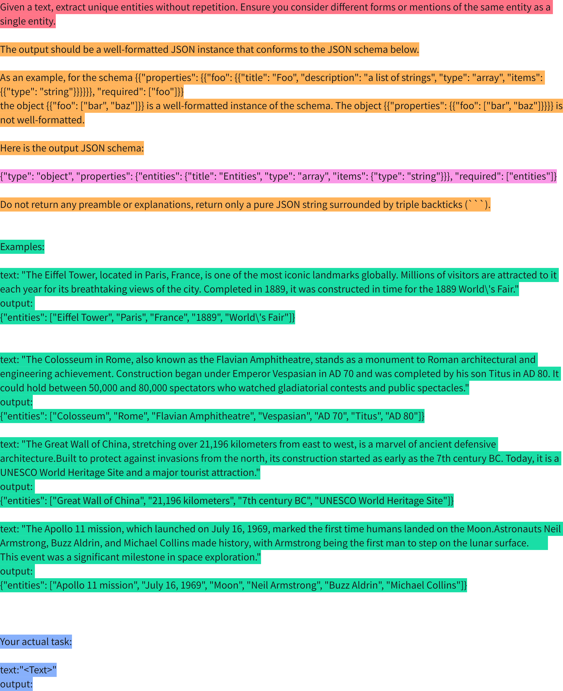

下图展示了`Context Entites Recall`计算过程

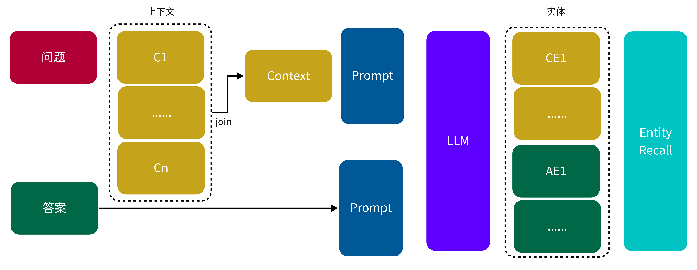

```python
import json
from pprint import pprint
from langchain_openai import ChatOpenAI

from langchain_core.prompts import ChatPromptTemplate


llm = ChatOpenAI(
    model="gpt-4o-mini"
)

PROMPT = ChatPromptTemplate.from_messages(
    [
        (
            "system", 
            """
            Given a text, extract unique entities without repetition. Ensure you consider different forms or mentions of the same entity as a single entity.

            The output should be a well-formatted JSON instance that conforms to the JSON schema below.

            As an example, for the schema {{"properties": {{"foo": {{"title": "Foo", "description": "a list of strings", "type": "array", "items": {{"type": "string"}}}}}}, "required": ["foo"]}}
            the object {{"foo": ["bar", "baz"]}} is a well-formatted instance of the schema. The object {{"properties": {{"foo": ["bar", "baz"]}}}} is not well-formatted.

            Here is the output JSON schema:

            {OutputSchema}
                                                
            Do not return any preamble or explanations, return only a pure JSON string surrounded by triple backticks (```).


            Examples:

            text: "The Eiffel Tower, located in Paris, France, is one of the most iconic landmarks globally. Millions of visitors are attracted to it each year for its breathtaking views of the city. Completed in 1889, it was constructed in time for the 1889 World\'s Fair."
            output: 
            {{"entities": ["Eiffel Tower", "Paris", "France", "1889", "World\'s Fair"]}}


            text: "The Colosseum in Rome, also known as the Flavian Amphitheatre, stands as a monument to Roman architectural and engineering achievement. Construction began under Emperor Vespasian in AD 70 and was completed by his son Titus in AD 80. It could hold between 50,000 and 80,000 spectators who watched gladiatorial contests and public spectacles."
            output:
            {{"entities": ["Colosseum", "Rome", "Flavian Amphitheatre", "Vespasian", "AD 70", "Titus", "AD 80"]}}

            text: "The Great Wall of China, stretching over 21,196 kilometers from east to west, is a marvel of ancient defensive architecture.Built to protect against invasions from the north, its construction started as early as the 7th century BC. Today, it is a UNESCO World Heritage Site and a major tourist attraction."
            output: 
            {{"entities": ["Great Wall of China", "21,196 kilometers", "7th century BC", "UNESCO World Heritage Site"]}}

            text: "The Apollo 11 mission, which launched on July 16, 1969, marked the first time humans landed on the Moon.Astronauts Neil Armstrong, Buzz Aldrin, and Michael Collins made history, with Armstrong being the first man to step on the lunar surface.         This event was a significant milestone in space exploration."
            output: 
            {{"entities": ["Apollo 11 mission", "July 16, 1969", "Moon", "Neil Armstrong", "Buzz Aldrin", "Michael Collins"]}}

            Your actual task:
            """
        ),
        (
            "human",
            """
            Your actual task:
            text: "{Text}"
            output:
            """
        )
    ]
)    

def get_v(text):
    output_schema = """
    {"type": "object", "properties": {"entities": {"title": "Entities", "type": "array", "items": {"type": "string"}}}, "required": ["entities"]}
    """
    chain = PROMPT | llm
    result = chain.invoke(
        {
            "OutputSchema": output_schema, "Text": text
        }
    )
    content = result.content
    if content.startswith("```json"):
        content = content.replace("```json", "")
    if content.endswith("```"):
        content = content.replace("```", "")
    try:
        content = json.loads(content)
    except:
        # verdict = None
        pass
    return content

classes = []
query = "艾菲尔铁塔在哪里"
contexts = [
    "埃菲尔铁塔（也常称为巴黎铁塔）是位于法国巴黎第七区、塞纳河畔战神广场的铁制镂空塔，世界著名建筑，也是法国文化象征之一[3]，巴黎城市地标之一，巴黎最高建筑物",
    "埃菲尔铁塔建成于1889年，初名为“三百米塔”，后得名自其设计师居斯塔夫·埃菲尔。"
]
answer = """
埃菲尔铁塔（法语：Tour Eiffel，/ˈaɪfəl/ [tuʁ‿ɛfɛl] （ⓘ），也常称为巴黎铁塔）是位于法国巴黎第七区、塞纳河畔战神广场的铁制镂空塔，世界著名建筑，也是法国文化象征之一[3]，巴黎城市地标之一，巴黎最高建筑物。正式地址为Rue Anatole-France 5号。

埃菲尔铁塔建成于1889年，初名为“三百米塔”，后得名自其设计师居斯塔夫·埃菲尔。铁塔是世界建筑史上的技术杰作，也是世界上最多人付费参观的名胜古迹，这个为了世界博览会而落成的金属建筑，2011年约有698万人参观[4]，是法国参观人数第二多的文化景点。1986年美国土木工程师协会将该建筑列入国际土木工程历史古迹，1991年，埃菲尔铁塔连同巴黎塞纳河沿岸整座被列入世界遗产。[5]

埃菲尔铁塔以312米的高度，占据世界最高人造建筑的位置长达四十年，直到纽约克莱斯勒大楼的出现，其位于279.11米处的观景平台是欧盟范围内公众能够抵达的最高的观景台，在全欧洲范围内仅次于莫斯科的奥斯坦金诺电视塔。铁塔的总高度曾通过安装天线而多次提高。这些天线曾被用于许多科学实验，现在主要用于发射广播电视信号。
"""
result_context = get_v(".".join(contexts))
pprint(result_context)
result_answer = get_v(answer)
pprint(result_answer)

def compute_score(
    ground_truth_entities, context_entities
) -> float:
    num_entities_in_both = len(
        set(context_entities).intersection(set(ground_truth_entities))
    )
    return num_entities_in_both / (len(ground_truth_entities) + 1e-8)

# for res in result:
#     classes.append(res["attributed"])
print("Context Entites Recall: ", compute_score(result_answer["entities"], result_context["entities"]))
```

```text
{'entities': ['埃菲尔铁塔',
              '巴黎铁塔',
              '法国',
              '巴黎',
              '塞纳河',
              '战神广场',
              '居斯塔夫·埃菲尔',
              '1889年',
              '三百米塔']}
{'entities': ['埃菲尔铁塔',
              '法语',
              '巴黎铁塔',
              '法国',
              '巴黎',
              '塞纳河',
              '战神广场',
              '1889年',
              '居斯塔夫·埃菲尔',
              '国际土木工程历史古迹',
              '1991年',
              '世界遗产',
              '312米',
              '纽约',
              '克莱斯勒大楼',
              '279.11米',
              '欧盟',
              '莫斯科',
              '奥斯坦金诺电视塔',
              '广播电视信号']}
Context Entites Recall:  0.3999999998
```

#### Answer Correctness

Answer Correctness（答案准确性） 是一种用于评估 RAG（Retrieval-Augmented Generation）应用生成的答案准确性的指标。其目标是衡量模型生成的答案与真实答案（Ground Truth）之间的匹配程度，从而判断模型是否生成了正确且有支持的内容。指标结合了经典的分类评价方法，将生成的答案分为正确识别（TP）、错误识别（FP）和遗漏（FN），帮助RAG应用回答的准确性。

1.	TP（True Positive，正确识别）：
- 定义：答案中的语句与真实答案中的语句匹配，且得到了真实答案的明确支持。
- 作用：识别出模型正确生成的信息。
2.	FP（False Positive，错误识别）：
- 定义：答案中出现了没有真实答案支持的语句，即错误信息或不相关内容。
- 作用：检测模型生成的无根据或错误信息。
3.	FN（False Negative，遗漏）：
- 定义：真实答案中的语句未出现在生成的答案中，即模型漏掉的重要信息。
- 作用：评估模型在回答时是否遗漏了关键信息。

Answer Correctness 计算公式

\[
\text{Answer Correctness} = \frac{|\text{TP}|}{|\text{TP} + 0.5 * (\text{FP} + \text{FN})|}
\]


其中大模型分类的Prompt如下所示：

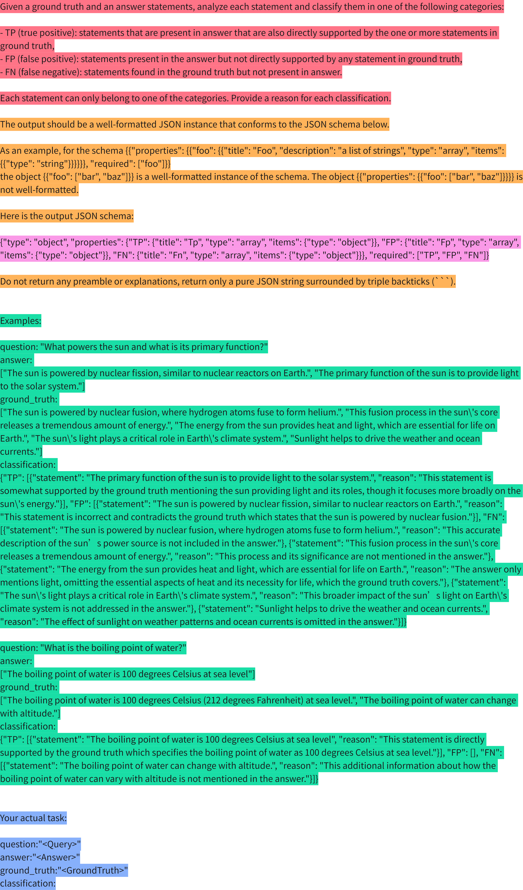


Answer Correctness 是一个加权的评估指标，同样的根据RAG应用回答分类也可以计算下面的几个指标：

1. 精准率（Precision）：反映生成的答案中，有多少比例是正确的内容。
\[
\text{Precision} = \frac{|\text{TP}|}{|\text{TP} + \text{FP}|}
\]

2. 召回率（Recall）：反映真实答案中的信息有多少被模型识别并生成。
\[
\text{Recall} = \frac{|\text{TP}|}{|\text{TP} + \text{FN}|}
\]
3. F1分数（F1 Score）：结合了精准率和召回率的平衡指标，作为整体评价。
\[
F1 = 2 \times \frac{\text{Precision} \times \text{Recall}}{\text{Precision} + \text{Recall}}
\]

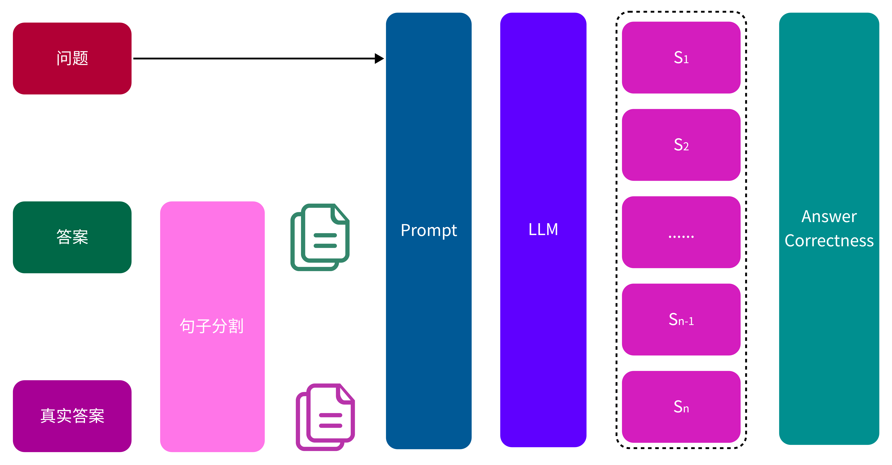

```python
import json
from pprint import pprint
from langchain_openai import ChatOpenAI

from langchain_core.prompts import ChatPromptTemplate


llm = ChatOpenAI(
    model="gpt-4o-mini"
)

PROMPT = ChatPromptTemplate.from_messages(
    [
        (
            "system", 
            """
            Given a ground truth and an answer statements, analyze each statement and classify them in one of the following categories:

            - TP (true positive): statements that are present in answer that are also directly supported by the one or more statements in ground truth,
            - FP (false positive): statements present in the answer but not directly supported by any statement in ground truth,
            - FN (false negative): statements found in the ground truth but not present in answer.

            Each statement can only belong to one of the categories. Provide a reason for each classification.

            The output should be a well-formatted JSON instance that conforms to the JSON schema below.
            As an example, for the schema {{"properties": {{"foo": {{"title": "Foo", "description": "a list of strings", "type": "array", "items": {{"type": "string"}}}}}}, "required": ["foo"]}}
            the object {{"foo": ["bar", "baz"]}} is a well-formatted instance of the schema. The object {{"properties": {{"foo": ["bar", "baz"]}}}} is not well-formatted.

            Here is the output JSON schema:

            {OutputSchema}
                                                
            Do not return any preamble or explanations, return only a pure JSON string surrounded by triple backticks (```).


            Examples:

            question: "What powers the sun and what is its primary function?"
            answer: 
            ["The sun is powered by nuclear fission, similar to nuclear reactors on Earth.", "The primary function of the sun is to provide light to the solar system."]
            ground_truth: 
            ["The sun is powered by nuclear fusion, where hydrogen atoms fuse to form helium.", "This fusion process in the sun\'s core releases a tremendous amount of energy.", "The energy from the sun provides heat and light, which are essential for life on Earth.", "The sun\'s light plays a critical role in Earth\'s climate system.", "Sunlight helps to drive the weather and ocean currents."]
            classification: 
            {{"TP": [{{"statement": "The primary function of the sun is to provide light to the solar system.", "reason": "This statement is somewhat supported by the ground truth mentioning the sun providing light and its roles, though it focuses more broadly on the sun\'s energy."}}], "FP": [{{"statement": "The sun is powered by nuclear fission, similar to nuclear reactors on Earth.", "reason": "This statement is incorrect and contradicts the ground truth which states that the sun is powered by nuclear fusion."}}], "FN": [{{"statement": "The sun is powered by nuclear fusion, where hydrogen atoms fuse to form helium.", "reason": "This accurate description of the sun’s power source is not included in the answer."}}, {{"statement": "This fusion process in the sun\'s core releases a tremendous amount of energy.", "reason": "This process and its significance are not mentioned in the answer."}}, {{"statement": "The energy from the sun provides heat and light, which are essential for life on Earth.", "reason": "The answer only mentions light, omitting the essential aspects of heat and its necessity for life, which the ground truth covers."}}, {{"statement": "The sun\'s light plays a critical role in Earth\'s climate system.", "reason": "This broader impact of the sun’s light on Earth\'s climate system is not addressed in the answer."}}, {{"statement": "Sunlight helps to drive the weather and ocean currents.", "reason": "The effect of sunlight on weather patterns and ocean currents is omitted in the answer."}}]}}

            question: "What is the boiling point of water?"
            answer: 
            ["The boiling point of water is 100 degrees Celsius at sea level"]
            ground_truth: 
            ["The boiling point of water is 100 degrees Celsius (212 degrees Fahrenheit) at sea level.", "The boiling point of water can change with altitude."]
            classification: 
            {{"TP": [{{"statement": "The boiling point of water is 100 degrees Celsius at sea level", "reason": "This statement is directly supported by the ground truth which specifies the boiling point of water as 100 degrees Celsius at sea level."}}], "FP": [], "FN": [{{"statement": "The boiling point of water can change with altitude.", "reason": "This additional information about how the boiling point of water can vary with altitude is not mentioned in the answer."}}]}}

            Your actual task:
            """
        ),
        (
            "human",
            """
            Your actual task:
            question:"{Query}"
            answer:"{Answer}"
            ground_truth:"{GroundTruth}"
            classification:
            """
        )
    ]
)    

def get_v(query, context, answer, ground_truth):
    output_schema = """
    {"type": "object", "properties": {"TP": {"title": "Tp", "type": "array", "items": {"type": "object"}}, "FP": {"title": "Fp", "type": "array", "items": {"type": "object"}}, "FN": {"title": "Fn", "type": "array", "items": {"type": "object"}}}, "required": ["TP", "FP", "FN"]}
    """
    chain = PROMPT | llm
    result = chain.invoke(
        {
            "OutputSchema": output_schema, "Query": query, "Context": context, "Answer": answer, "GroundTruth": ground_truth
        }
    )
    content = result.content
    if content.startswith("```json"):
        content = content.replace("```json", "")
    if content.endswith("```"):
        content = content.replace("```", "")
    try:
        content = json.loads(content)
    except:
        # verdict = None
        pass
    return content

classes = []
query = "介绍下艾菲尔铁塔"
contexts = [
    "埃菲尔铁塔（也常称为巴黎铁塔）是位于法国巴黎第七区、塞纳河畔战神广场的铁制镂空塔，世界著名建筑，也是法国文化象征之一[3]，巴黎城市地标之一，巴黎最高建筑物",
    "埃菲尔铁塔建成于1889年，初名为“三百米塔”，后得名自其设计师居斯塔夫·埃菲尔。"
]
ground_truth = """
埃菲尔铁塔（法语：Tour Eiffel，/ˈaɪfəl/ [tuʁ‿ɛfɛl] （ⓘ），也常称为巴黎铁塔）是位于法国巴黎第七区、塞纳河畔战神广场的铁制镂空塔，世界著名建筑，也是法国文化象征之一[3]，巴黎城市地标之一，巴黎最高建筑物。正式地址为Rue Anatole-France 5号。

埃菲尔铁塔建成于1889年，初名为“三百米塔”，后得名自其设计师居斯塔夫·埃菲尔。铁塔是世界建筑史上的技术杰作，也是世界上最多人付费参观的名胜古迹，这个为了世界博览会而落成的金属建筑，2011年约有698万人参观[4]，是法国参观人数第二多的文化景点。1986年美国土木工程师协会将该建筑列入国际土木工程历史古迹，1991年，埃菲尔铁塔连同巴黎塞纳河沿岸整座被列入世界遗产。[5]

埃菲尔铁塔以312米的高度，占据世界最高人造建筑的位置长达四十年，直到纽约克莱斯勒大楼的出现，其位于279.11米处的观景平台是欧盟范围内公众能够抵达的最高的观景台，在全欧洲范围内仅次于莫斯科的奥斯坦金诺电视塔。铁塔的总高度曾通过安装天线而多次提高。这些天线曾被用于许多科学实验，现在主要用于发射广播电视信号。
"""
answer = "埃菲尔铁塔（也常称为巴黎铁塔）位于法国巴黎第七区"
result = get_v(query, ".".join(contexts), answer, ground_truth)
pprint(result)


def compute_statement_presence(
    prediction
) -> float:
    tp = len(prediction["TP"])
    fp = len(prediction["FP"])
    fn = len(prediction["FN"])
    score = tp / (tp + 0.5 * (fp + fn)) if tp > 0 else 0
    return score

print("Answer Correctness: ", compute_statement_presence(result))
```

```text
{'FN': [{'reason': 'This detailed description of the Eiffel Tower, including '
                   'its material, cultural significance, and formal address, '
                   'is missing from the answer.',
         'statement': '埃菲尔铁塔是位于法国巴黎第七区、塞纳河畔战神广场的铁制镂空塔，世界著名建筑，也是法国文化象征之一，巴黎城市地标之一，巴黎最高建筑物。正式地址为Rue '
                      'Anatole-France 5号。'},
        {'reason': 'The construction year and original name of the Eiffel '
                   'Tower are not mentioned in the answer.',
         'statement': '埃菲尔铁塔建成于1889年，初名为“三百米塔”，后得名自其设计师居斯塔夫·埃菲尔。'},
        {'reason': 'The answer does not include any information about its '
                   'status as a historical engineering marvel or visitor '
                   'statistics.',
         'statement': '铁塔是世界建筑史上的技术杰作，也是世界上最多人付费参观的名胜古迹，这个为了世界博览会而落成的金属建筑，2011年约有698万人参观，是法国参观人数第二多的文化景点。'},
        {'reason': 'This important historical recognition of the Eiffel Tower '
                   'is absent in the answer.',
         'statement': '1986年美国土木工程师协会将该建筑列入国际土木工程历史古迹，1991年，埃菲尔铁塔连同巴黎塞纳河沿岸整座被列入世界遗产。'},
        {'reason': 'The height of the Eiffel Tower and its ranking among '
                   'man-made structures are not mentioned in the answer.',
         'statement': '埃菲尔铁塔以312米的高度，占据世界最高人造建筑的位置长达四十年，直到纽约克莱斯勒大楼的出现。'},
        {'reason': 'Information about the viewing platform and its '
                   'significance is missing from the answer.',
         'statement': '其位于279.11米处的观景平台是欧盟范围内公众能够抵达的最高的观景台，在全欧洲范围内仅次于莫斯科的奥斯坦金诺电视塔。'},
        {'reason': 'The mention of the antennas and their functions is not '
                   'covered in the answer.',
         'statement': '铁塔的总高度曾通过安装天线而多次提高。这些天线曾被用于许多科学实验，现在主要用于发射广播电视信号。'}],
 'FP': [],
 'TP': [{'reason': 'This statement is directly supported by the ground truth, '
                   'which states that the Eiffel Tower is located in the 7th '
                   'arrondissement of Paris.',
         'statement': '埃菲尔铁塔位于法国巴黎第七区'}]}
Answer Correctness:  0.2222222222222222
```

#### Answer Semantic Similarity

Answer Semantic Similarity（答案的语义相似性）是用来评估生成答案与原始事实在语义上相近程度的关键指标。通过计算生成答案与基本事实的嵌入向量之间的余弦相似度，可以量化这种相似性。如果设定了一个特定的阈值，根据计算结果，得分会被转换为二进制值；即，当余弦相似度大于或等于该阈值时，值为1，否则为0。

\[
   Answer\:Semantic\:Similarity = \cos(\hat{v}_{\text{answer}}, \hat{v}_{\text{fact}})
\]

- \(\hat{v}_{\text{answer}}\)：表示生成答案的嵌入向量。
- \(\hat{v}_{\text{fact}}\)：表示基本事实的嵌入向量。
- 阈值：用于将相似度得分转换为二进制判断的临界值。


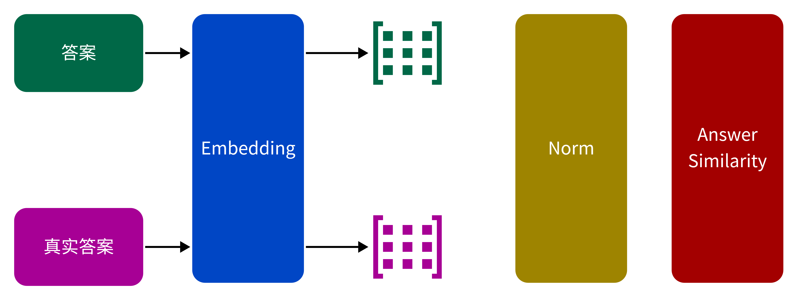

```python
import numpy as np
from langchain_openai import OpenAIEmbeddings

embeddings = OpenAIEmbeddings(
    model="text-embedding-3-small",
)

query = "介绍下艾菲尔铁塔"
ground_truth = """
埃菲尔铁塔（法语：Tour Eiffel，/ˈaɪfəl/ [tuʁ‿ɛfɛl] （ⓘ），也常称为巴黎铁塔）是位于法国巴黎第七区、塞纳河畔战神广场的铁制镂空塔，世界著名建筑，也是法国文化象征之一[3]，巴黎城市地标之一，巴黎最高建筑物。正式地址为Rue Anatole-France 5号。

埃菲尔铁塔建成于1889年，初名为“三百米塔”，后得名自其设计师居斯塔夫·埃菲尔。铁塔是世界建筑史上的技术杰作，也是世界上最多人付费参观的名胜古迹，这个为了世界博览会而落成的金属建筑，2011年约有698万人参观[4]，是法国参观人数第二多的文化景点。1986年美国土木工程师协会将该建筑列入国际土木工程历史古迹，1991年，埃菲尔铁塔连同巴黎塞纳河沿岸整座被列入世界遗产。[5]

埃菲尔铁塔以312米的高度，占据世界最高人造建筑的位置长达四十年，直到纽约克莱斯勒大楼的出现，其位于279.11米处的观景平台是欧盟范围内公众能够抵达的最高的观景台，在全欧洲范围内仅次于莫斯科的奥斯坦金诺电视塔。铁塔的总高度曾通过安装天线而多次提高。这些天线曾被用于许多科学实验，现在主要用于发射广播电视信号。
"""
answer = "埃菲尔铁塔（也常称为巴黎铁塔）位于法国巴黎第七区"


def compute_similarity(
    answer, ground_truth, embeddings
) -> float:
    embedding_1 = np.array(embeddings.embed_query(ground_truth))
    embedding_2 = np.array(embeddings.embed_query(answer))
    # Normalization factors of the above embeddings
    norms_1 = np.linalg.norm(embedding_1, keepdims=True)
    norms_2 = np.linalg.norm(embedding_2, keepdims=True)
    embedding_1_normalized = embedding_1 / norms_1
    embedding_2_normalized = embedding_2 / norms_2
    similarity = embedding_1_normalized @ embedding_2_normalized.T
    score = similarity.flatten()
    return score

print("Answer Correctness: ", compute_similarity(answer, ground_truth, embeddings))
```

```text
Answer Correctness:  [0.70861593]
```

#### Answer Fathfulness
Faithfulness（忠实性）指标用于衡量生成答案与给定上下文之间的事实一致性。该指标通过生成答案和检索到的上下文进行计算，其结果被缩放至 (0,1) 区间，数值越高表示忠实性越强。

如果生成的答案中所做出的所有陈述都能够从给定的上下文中推导出来，则视为忠实。在计算忠实性时，首先从生成的答案中识别出一组陈述，然后将每一个陈述与给定的上下文进行逐一核对，判断其是否可以从上下文中推导出来。忠实性得分的计算公式如下：
\[
Faithfulness score = \frac{可以推导出的陈述数量}{陈述总数量}
\]


- 可以推导出的陈述数量：指生成答案中，与给定上下文核对后确认可以推导出的陈述数量。
- 陈述总数量：指从生成的答案中识别出的全部陈述数量。

其中陈述总数量是通过大模型进行拆分，下面是根据RAG输出的答案生成陈述的Prompt

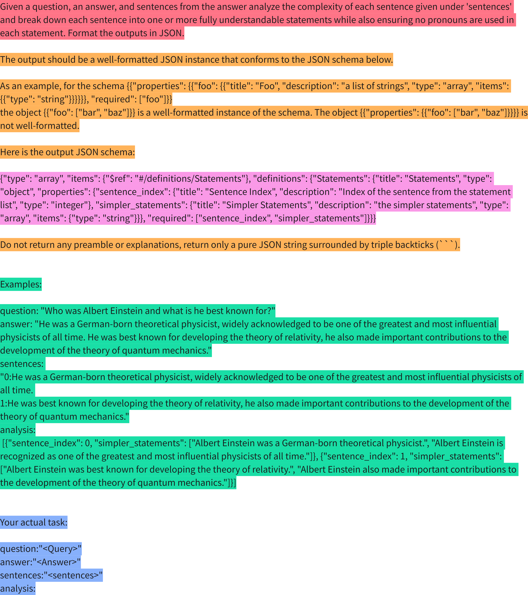

可以推导出的陈述数量也是通过大模型进行判断，根据上述过程生成的陈述以及检索到的上下文，判断模型生成的答案是否可以在上下文中找到依据，下面给定上下文判断是否可以推导出的陈述的Prompt

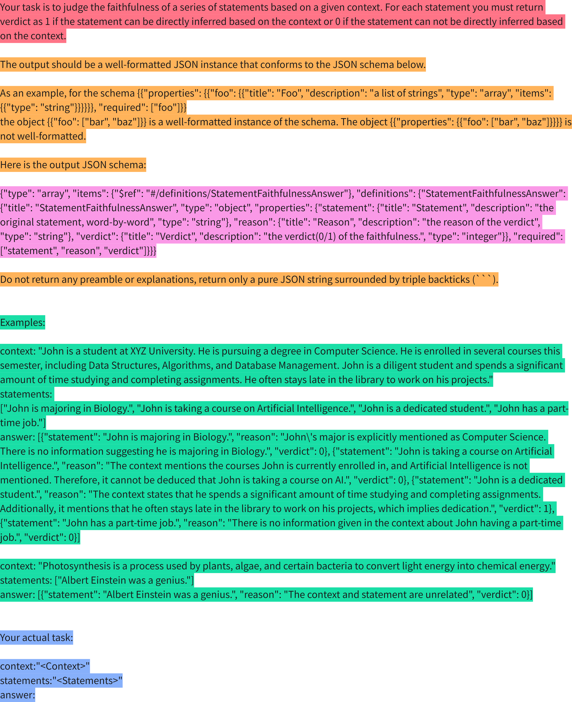

下面是Answer Fathfulness的计算过程

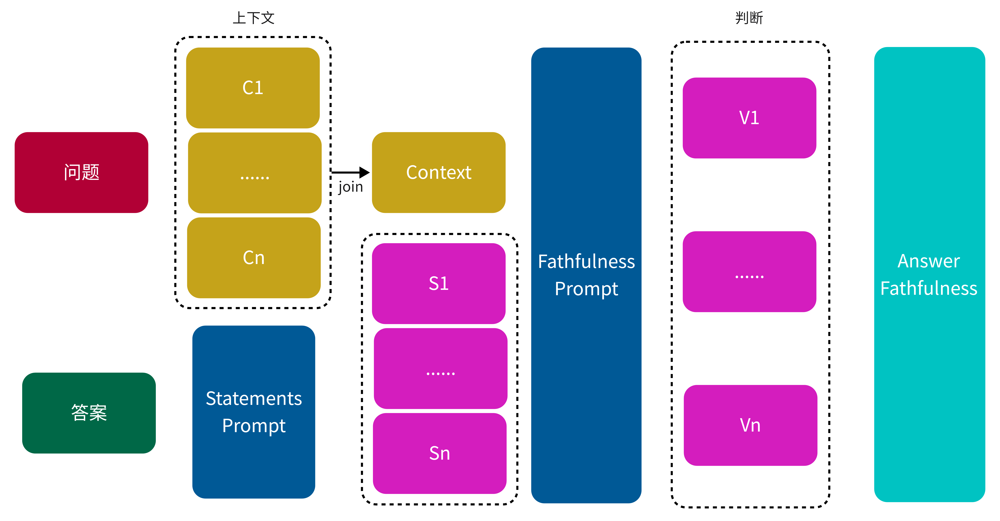

```python
import json
from pprint import pprint
from langchain_openai import ChatOpenAI
from pysbd import Segmenter
from langchain_core.prompts import ChatPromptTemplate


llm = ChatOpenAI(
    model="gpt-4o-mini"
)

STATEMENTS_PROMPT = ChatPromptTemplate.from_messages(
    [
        (
            "system", 
            """
            Given a question, an answer, and sentences from the answer analyze the complexity of each sentence given under 'sentences' and break down each sentence into one or more fully understandable statements while also ensuring no pronouns are used in each statement. Format the outputs in JSON.

            The output should be a well-formatted JSON instance that conforms to the JSON schema below.
            As an example, for the schema {{"properties": {{"foo": {{"title": "Foo", "description": "a list of strings", "type": "array", "items": {{"type": "string"}}}}}}, "required": ["foo"]}}
            the object {{"foo": ["bar", "baz"]}} is a well-formatted instance of the schema. The object {{"properties": {{"foo": ["bar", "baz"]}}}} is not well-formatted.

            Here is the output JSON schema:

            {OutputSchema}
                                                
            Do not return any preamble or explanations, return only a pure JSON string surrounded by triple backticks (```).


            Examples:
            question: "Who was Albert Einstein and what is he best known for?"
            answer: "He was a German-born theoretical physicist, widely acknowledged to be one of the greatest and most influential physicists of all time. He was best known for developing the theory of relativity, he also made important contributions to the development of the theory of quantum mechanics."
            sentences: 
            "0:He was a German-born theoretical physicist, widely acknowledged to be one of the greatest and most influential physicists of all time. 
            1:He was best known for developing the theory of relativity, he also made important contributions to the development of the theory of quantum mechanics."
            analysis:
            [{{"sentence_index": 0, "simpler_statements": ["Albert Einstein was a German-born theoretical physicist.", "Albert Einstein is recognized as one of the greatest and most influential physicists of all time."]}}, {{"sentence_index": 1, "simpler_statements": ["Albert Einstein was best known for developing the theory of relativity.", "Albert Einstein also made important contributions to the development of the theory of quantum mechanics."]}}]

            Your actual task:
            """
        ),
        (
            "human",
            """
            Your actual task:
            question:"{Query}"
            answer:"{Answer}"
            sentences:"{Sentences}"
            analysis:
            """
        )
    ]
)    

def get_statements(query, answer, sentences):
    output_schema = """
    {"type": "array", "items": {"$ref": "#/definitions/Statements"}, "definitions": {"Statements": {"title": "Statements", "type": "object", "properties": {"sentence_index": {"title": "Sentence Index", "description": "Index of the sentence from the statement list", "type": "integer"}, "simpler_statements": {"title": "Simpler Statements", "description": "the simpler statements", "type": "array", "items": {"type": "string"}}}, "required": ["sentence_index", "simpler_statements"]}}}
    """
    chain = STATEMENTS_PROMPT | llm
    result = chain.invoke(
        {
            "OutputSchema": output_schema, "Query": query, "Answer": answer, "Sentences": sentences
        }
    )
    content = result.content
    if content.startswith("```json"):
        content = content.replace("```json", "")
    if content.endswith("```"):
        content = content.replace("```", "")
    try:
        content = json.loads(content)
    except:
        # verdict = None
        pass
    return content

classes = []
query = "介绍下艾菲尔铁塔"
contexts = [
    "埃菲尔铁塔（也常称为巴黎铁塔）是位于法国巴黎第七区、塞纳河畔战神广场的铁制镂空塔，世界著名建筑，也是法国文化象征之一[3]，巴黎城市地标之一，巴黎最高建筑物",
    "埃菲尔铁塔建成于1889年，初名为“三百米塔”，后得名自其设计师居斯塔夫·埃菲尔。"
]
ground_truth = """
埃菲尔铁塔（法语：Tour Eiffel，/ˈaɪfəl/ [tuʁ‿ɛfɛl] （ⓘ），也常称为巴黎铁塔）是位于法国巴黎第七区、塞纳河畔战神广场的铁制镂空塔，世界著名建筑，也是法国文化象征之一[3]，巴黎城市地标之一，巴黎最高建筑物。正式地址为Rue Anatole-France 5号。

埃菲尔铁塔建成于1889年，初名为“三百米塔”，后得名自其设计师居斯塔夫·埃菲尔。铁塔是世界建筑史上的技术杰作，也是世界上最多人付费参观的名胜古迹，这个为了世界博览会而落成的金属建筑，2011年约有698万人参观[4]，是法国参观人数第二多的文化景点。1986年美国土木工程师协会将该建筑列入国际土木工程历史古迹，1991年，埃菲尔铁塔连同巴黎塞纳河沿岸整座被列入世界遗产。[5]

埃菲尔铁塔以312米的高度，占据世界最高人造建筑的位置长达四十年，直到纽约克莱斯勒大楼的出现，其位于279.11米处的观景平台是欧盟范围内公众能够抵达的最高的观景台，在全欧洲范围内仅次于莫斯科的奥斯坦金诺电视塔。铁塔的总高度曾通过安装天线而多次提高。这些天线曾被用于许多科学实验，现在主要用于发射广播电视信号。
"""
answer = "埃菲尔铁塔（也常称为巴黎铁塔）位于法国巴黎第七区"

seg = Segmenter(language="zh")
statements = seg.segment(answer)

result = get_statements(query, answer, statements)
pprint(result)


FATHFULNESS_PROMPT = ChatPromptTemplate.from_messages(
    [
        (
            "system", 
            """
            Your task is to judge the faithfulness of a series of statements based on a given context. For each statement you must return verdict as 1 if the statement can be directly inferred based on the context or 0 if the statement can not be directly inferred based on the context.
            
            The output should be a well-formatted JSON instance that conforms to the JSON schema below.
            As an example, for the schema {{"properties": {{"foo": {{"title": "Foo", "description": "a list of strings", "type": "array", "items": {{"type": "string"}}}}}}, "required": ["foo"]}}
            the object {{"foo": ["bar", "baz"]}} is a well-formatted instance of the schema. The object {{"properties": {{"foo": ["bar", "baz"]}}}} is not well-formatted.

            Here is the output JSON schema:

            {OutputSchema}
                                                
            Do not return any preamble or explanations, return only a pure JSON string surrounded by triple backticks (```).


            Examples:
            context: "John is a student at XYZ University. He is pursuing a degree in Computer Science. He is enrolled in several courses this semester, including Data Structures, Algorithms, and Database Management. John is a diligent student and spends a significant amount of time studying and completing assignments. He often stays late in the library to work on his projects."
            statements: ["John is majoring in Biology.", "John is taking a course on Artificial Intelligence.", "John is a dedicated student.", "John has a part-time job."]
            answer: [{{"statement": "John is majoring in Biology.", "reason": "John\'s major is explicitly mentioned as Computer Science. There is no information suggesting he is majoring in Biology.", "verdict": 0}}, {{"statement": "John is taking a course on Artificial Intelligence.", "reason": "The context mentions the courses John is currently enrolled in, and Artificial Intelligence is not mentioned. Therefore, it cannot be deduced that John is taking a course on AI.", "verdict": 0}}, {{"statement": "John is a dedicated student.", "reason": "The context states that he spends a significant amount of time studying and completing assignments. Additionally, it mentions that he often stays late in the library to work on his projects, which implies dedication.", "verdict": 1}}, {{"statement": "John has a part-time job.", "reason": "There is no information given in the context about John having a part-time job.", "verdict": 0}}]

            context: "Photosynthesis is a process used by plants, algae, and certain bacteria to convert light energy into chemical energy."
            statements: ["Albert Einstein was a genius."]
            answer: [{{"statement": "Albert Einstein was a genius.", "reason": "The context and statement are unrelated", "verdict": 0}}]
            
            Your actual task:
            """
        ),
        (
            "human",
            """
            Your actual task:
            context:"{Context}"
            statements:"{Statements}"
            answer:
            """
        )
    ]
)


def get_fathfullness_results(context, statements):
    output_schema = """
    {"type": "array", "items": {"$ref": "#/definitions/StatementFaithfulnessAnswer"}, "definitions": {"StatementFaithfulnessAnswer": {"title": "StatementFaithfulnessAnswer", "type": "object", "properties": {"statement": {"title": "Statement", "description": "the original statement, word-by-word", "type": "string"}, "reason": {"title": "Reason", "description": "the reason of the verdict", "type": "string"}, "verdict": {"title": "Verdict", "description": "the verdict(0/1) of the faithfulness.", "type": "integer"}}, "required": ["statement", "reason", "verdict"]}}}
    """
    chain = FATHFULNESS_PROMPT | llm
    result = chain.invoke(
        {
            "OutputSchema": output_schema, "Context": context, "Statements": statements
        }
    )
    content = result.content
    if content.startswith("```json"):
        content = content.replace("```json", "")
    if content.endswith("```"):
        content = content.replace("```", "")
    try:
        content = json.loads(content)
    except:
        # verdict = None
        pass
    return content

results = get_fathfullness_results(".".join(contexts), statements)
print(results)

verdicts = [_["verdict"] for _ in results]
print("Answer Fathfulness: ", sum(verdicts) / len(verdicts))
```

```text
[{'sentence_index': 0,
  'simpler_statements': ['埃菲尔铁塔也常称为巴黎铁塔。', '埃菲尔铁塔位于法国巴黎第七区。']}]
[{'statement': '埃菲尔铁塔（也常称为巴黎铁塔）位于法国巴黎第七区', 'reason': '上下文明确提到埃菲尔铁塔位于法国巴黎第七区，因此该陈述可以直接推断。', 'verdict': 1}]
Answer Fathfulness:  1.0
```

## 讨论
在本文中，我们探讨了基于大型语言模型的RAG应用自动化评估方法，并详细阐述了每个评估指标的提示设计及其Python实现方式。通过本篇文章，我们不仅理解了如何利用大型语言模型进行评估，还可以根据自身的业务场景制定相应的评估指标。

值得注意的是，在上述评估指标的计算过程中，我们使用了几个关键要素，即`Query`、`Context`、`Answer`和`Ground Truth`。其中，`Query`、`Context`和`Answer`是RAG应用的输入、中间变量和生成结果，这些要素相对容易获取。然而，获取`Ground Truth`通常较为困难。在一般情况下，`Ground Truth`可通过人工或专家标注获得，但这种方法往往需要大量的人力资源。

如果我们能够解决自动生成`Ground Truth`的过程，那么整个评估流程将会实现自动化。在下一篇文章中，我们将深入探讨[如何自动生成RAG应用评估数据集](/p/rag_how_to_generate_rag_evaluate_dataset/ "如何自动生成RAG应用评估数据集")。

## 引用
1. Yu H, Gan A, Zhang K, et al. [Evaluation of Retrieval-Augmented Generation: A Survey[J]](https://arxiv.org/pdf/2005.11401). arXiv preprint arXiv:2405.07437, 2024.
2. https://research.trychroma.com/evaluating-chunking
3. https://github.com/explodinggradients/ragas
