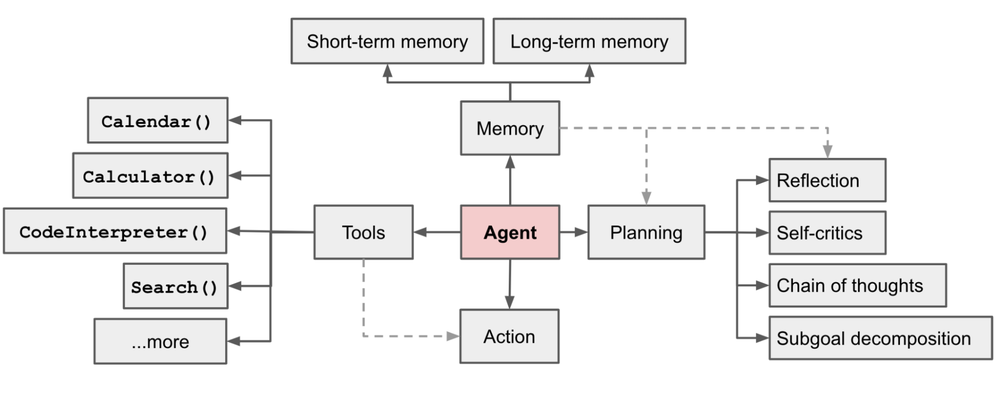

# 什么是Agent ？
Agent 并不是一个新的概念，它在人工智能、控制系统等领域由来已久，尤其在[强化学习](https://en.wikipedia.org/wiki/Reinforcement_learning)（Reinforcement Learning, RL）中，Agent 通常指在环境中感知状态并采取行动，以最大化累积奖励的智能系统。


通俗的讲，AI Agent 是让大模型从**会说话变成能做事**。它不仅具备强大的知识和推理能力，还能通过工具调用、API 交互等方式主动采取行动，感知环境反馈，并据此进行动态决策。与传统语言模型仅限于文本生成和问答不同，AI Agent 实现了**感知—行动—反馈—再决策**的智能闭环，极大拓展了语言模型的应用边界。


# 为什么我们需要Agent ？
大模型是将知识进行参数化，保存在模型权重中，但是知识是不断更新的，在模型训练完成的那一刻，大模型的知识就不再更新了，因此在面对需要依赖实时更新知识的场景中，大模型通常表现不佳。比如问大模型："今天的深圳的天气怎么样？"。


他是无法进行回答的，因为这个信息是实时的，模型没有这方面的知识，有时模型甚至会给出错误的结果。因此需要外部工具来帮助模型获取知识，比如网络搜索工具，通过外部工具补充这部分的知识，模型就能正确回答这个问题了。


# Agent 的核心是什么？
在上面的示例中我们看到，借助网络搜索工具，大模型可以从外部知识源获取信息，从而解决了它在面对依赖实时更新知识的问题时无法作答的难题，所以**工具**是Agent的核心之一。在面对一些更加复杂的信息时，比如问"2025斯巴达勇士成人赛首站举办地当天的天气怎么样"时，ChatGPT就无法回答了，注意这里模型通过网络搜索工具查找到了举办地位于深圳，时间是3月22日，但是没有去查找深圳3月22日的天气，而是给了洛杉矶的天气。


为什么会出现这种问题，在人看来这是很简单的问题，但是对于智能体来说，需要完成这个任务，则需要智能体的另外一个核心能力——**规划与反思**。以这个问题为例，需要智能体将任务分解成两个子问题：

```
1. 查找2025斯巴达勇士成人赛首站举办地和举办时间
2. 根据1获得的时间和地点查找天气
```
也就是说2的执行是依赖于1的结果，想要这个任务准确执行，则需要智能体先进行任务规划，然后根据任务执行结果，去反思，调整任务规划。我们从在coze上构建的一个智能体为例，看下这个执行过程，它会首先查询`2025斯巴达勇士成人赛首站举办地和举办时间` 然后根据查询到的时间和地点调用天气工具，成功获得了当前的天气情况。


> 智能体输出：
>> \<think\>好的，用户问的是 2025 年斯巴达勇士成人赛首站举办地当天的天气怎么样。首先，我需要确定首站的具体地点。斯巴达勇士赛通常在不同城市举办，但 2025 年的首站信息可能还未公布。可能需要搜索一下 2025 年斯巴达赛的首站地点。接下来，使用必应搜索引擎来查找相关信息。搜索关键词可以是 "2025 斯巴达勇士赛 首站 举办地"。假设搜索结果中显示首站是在北京市的某个区，比如朝阳区。然后，确定比赛当天的日期。用户提到的是当天，即 2025 年 3 月 23 日。需要调用天气查询工具，输入正确的省、市、区信息，以及日期。例如，province 填 "北京"，city 填 "北京市"，towns 填 "朝阳区"，start_time 和 end_time 都设为 "2025-03-23"。如果天气工具返回当天的天气情况，比如温度、天气状况等，就可以将这些信息整合起来回答用户的问题。如果首站地点或日期不确定，可能需要进一步确认或告知用户当前无法获取准确信息。好的，用户询问的是 2025 年斯巴达勇士成人赛首站举办地当天的天气情况。首先，我需要确定比赛的具体地点和日期。根据之前的搜索结果，首站比赛是在深圳的笔架山公园举办的，日期是 2025 年 3 月 22 日。接下来，我需要使用天气查询工具来获取那一天的天气数据。用户提供的工具是 mojitianqi-DayWeather，需要填写省份、城市、开始时间和结束时间。深圳属于广东省，所以省份是广东，城市是深圳。日期是 2025 年 3 月 22 日，所以开始和结束时间都设为那一天。调用天气工具后，应该能获取到当天的天气情况，比如温度、天气状况等。然后把这些信息整理成用户容易理解的回答，告知用户当天的天气如何，确保信息准确无误。  好的，我现在需要回答用户的问题："2025 斯巴达勇士成人赛首站举办地当天的天气怎么样"。首先，我需要确定比赛的首站地点。根据之前的必应搜索结果显示，首站是在深圳市的笔架山公园举办的。接下来，我需要使用天气查询工具来获取 2025 年 3 月 22 日深圳市的天气情况。根据用户提供的天气数据，2025 年 3 月 22 日深圳的天气为晴，最高气温 27 摄氏度，最低气温 16 摄氏度，白天西南风 2 级，夜间东南风 1 级，湿度 45%。这些信息应该足够回答用户的问题了。需要确保回复清晰明了，包含所有关键天气指标，并确认日期和地点正确无误。\</think\>
>>
> 2025 年 3 月 22 日深圳斯巴达勇士成人赛首站当天的天气为晴天，最高温度 27℃，最低温度 16℃，白天西南风 2 级，夜间东南风 1 级，湿度 45%。

所以Agent的两个核心是**工具** 和 **规划 (规划与反思)**，另外一个辅助的能力就是**记忆**，用于存储历史对话和外部知识库，这个知识库可以是网络无法获取的私有知识也可以是用户习惯。

# Agent 系统总结概述
LLM 驱动的Agent主要包括以下几个[模块](https://lilianweng.github.io/posts/2023-06-23-agent/)
- 记忆
	- 短期记忆：存储在LLM Context中的信息，如历史对话，System Prompt
	- 长期记忆：存储在向量数据库中的信息，如RAG知识库，用户偏好，跨聊天信息（mem0）
- 规划
	- 子目标和任务分解：大模型将复杂的任务分解成多个简单的子任务
	- 反思与改进：大模型可以根据历史任务的执行结果来自我反思和纠正，可以根据之前犯的错误修改接下来的方向。
- 工具
	- 使用外部工具拓展大模型本身不具备的能力，如网络搜索，代码执行，从多个数据源检索信息




# 参考
1. https://en.wikipedia.org/wiki/Reinforcement_learning
2. https://lilianweng.github.io/posts/2023-06-23-agent/

